# Sending the shelf photos — mockups for approval

D-37 (2026-10-06): the app gets an upload screen, so the store's shelf photos reach the shelf
reader without anyone moving files. These are the screen and its words, and the two ways a photo
could travel. Nothing here is merged or shown to the store until the owner approves it (F12-S1
C-75).

**How they were made.** They were drawn inside the real app, in the e2e build, at phone size
(390 × 844), so the header, fonts, colours and buttons are the app's own. The code is on the
branch `feat/photo-upload`, which is not merged. In these pictures:
- **Send** goes nowhere. It waits 0.4 s and reports success, so that the "sent" state could be
  drawn. Nothing was sent;
- the chosen photo is the reader's **drawn test shelf** (`tests/fixtures/shelf_photos/draw.py`),
  not a store's photo;
- the units in the list are the marked example's three units (`public/examples/shelf-plan-example.json`),
  shown as if they were the store's own.

## What the owner is asked to decide

1. **The screen**, on Store layout, as drawn below: name the unit, take or choose the photo, see
   it, press Send. A team account sees it disabled.
2. **Its wording**, in the three languages (table below).
3. **How a photo travels** (ADR-042):
   - **B, Firestore (recommended).** It works on the project as it is: the free plan, the rules
     already deployed, and the account the nightly already uses. The app splits a photo into
     parts under 1 MB, and the nightly joins them and checks them;
   - **A, Cloud Storage for Firebase.** The usual place for files, but since 2026-02-03 it needs
     Firebase's Blaze plan, which needs a billing account and a card.
4. **The nightly reads what it collected.** When photos arrive and the model key is set, the
   nightly reads them before it builds the page, so the next morning shows the pictures and the
   facings. Today the reader runs only when someone types a command (ADR-041), and the owner
   cannot type one.
5. **Two older sentences** that still say the team measures each product's width. Since D-34
   the reader does, and the team still records each shelf's length (ADR-037). The proposed texts
   are at the end of the wording table. Saying no to this keeps them as they are.

**One thing the upload does not do.** The reader reads only with the model key, which is not set
in the repository's secrets today (`ANTHROPIC_API_KEY`, read by the nightly as
`SMARTSHELF_ANTHROPIC_API_KEY`). Without it, the photos arrive and wait, and the list says
"collected", never "read".

## The screens

### Today: no layout file

The first photos come before the layout does, so the unit is named by typing it.

| العربية | עברית |
|---|---|
| 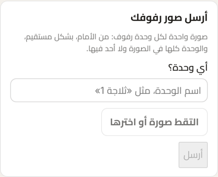 | 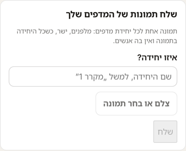 |

### A photo chosen

The photo is shown before it is sent. Send is enabled once there is a unit and a photo.

| العربية | עברית |
|---|---|
| 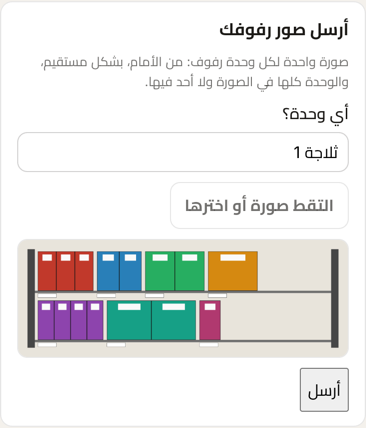 | 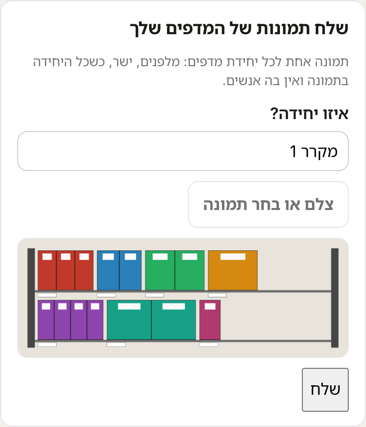 |

### Sent

The screen says the photo was sent and when it reaches the reader, and lists it. Later states
("collected", "read") replace "sent, collected tonight" in the same list.

| العربية | עברית |
|---|---|
| 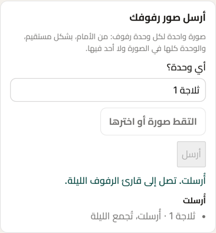 | 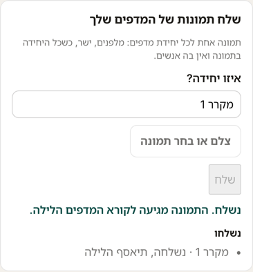 |

### With units recorded

The unit is chosen from those recorded. "Another unit" opens the name field.

| العربية | עברית |
|---|---|
| 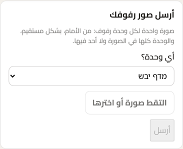 | 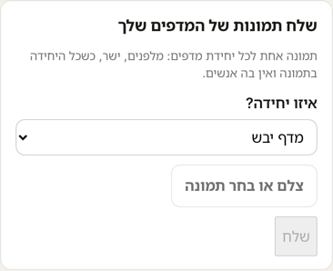 |

### Where it sits on the page

At the top of Store layout, under the page's opening, above the units.

| العربية | עברית |
|---|---|
| 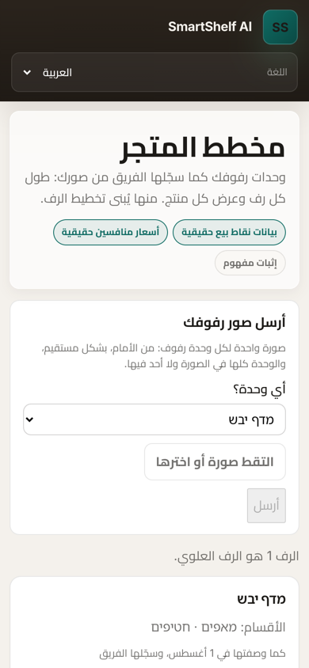 | 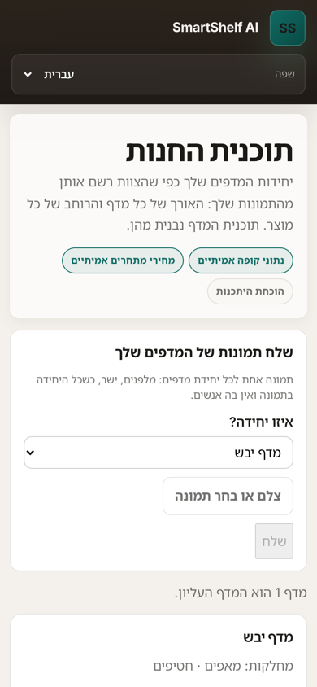 |

### The team account

Read-only, as every control is for the team (ADR-029).

| العربية | עברית |
|---|---|
| 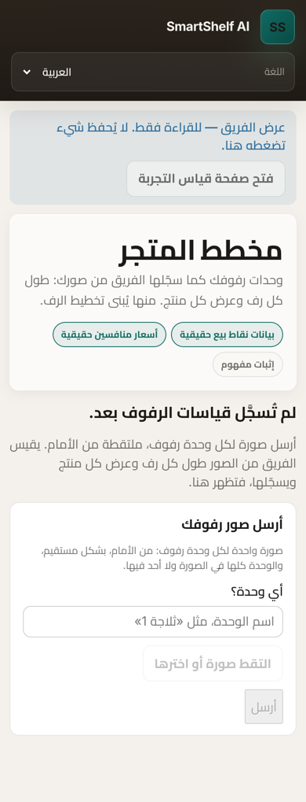 | 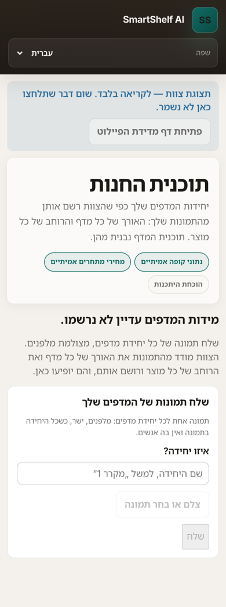 |

## The new wording

Every phrase the screen adds, as the dictionaries hold it on the branch. `{date}` is a date in
the page's own format.

| Key | English | עברית | العربية |
|---|---|---|---|
| `photos.title` | Send photos of your shelves | שלח תמונות של המדפים שלך | أرسل صور رفوفك |
| `photos.how` | One photo for each shelving unit: from the front, straight on, with the whole unit in the picture and no one in it. | תמונה אחת לכל יחידת מדפים: מלפנים, ישר, כשכל היחידה בתמונה ואין בה אנשים. | صورة واحدة لكل وحدة رفوف: من الأمام، بشكل مستقيم، والوحدة كلها في الصورة ولا أحد فيها. |
| `photos.unit` | Which unit? | איזו יחידה? | أي وحدة؟ |
| `photos.unit.other` | Another unit | יחידה אחרת | وحدة أخرى |
| `photos.unit.name` | The unit's name, such as “Fridge 1” | שם היחידה, למשל „מקרר 1” | اسم الوحدة، مثل «ثلاجة 1» |
| `photos.choose` | Take or choose a photo | צלם או בחר תמונה | التقط صورة أو اخترها |
| `photos.send` | Send | שלח | أرسل |
| `photos.sending` | Sending… | שולח… | جارٍ الإرسال… |
| `photos.sent` | Sent. It reaches the shelf reader tonight. | נשלח. התמונה מגיעה לקורא המדפים הלילה. | أُرسلت. تصل إلى قارئ الرفوف الليلة. |
| `photos.failed` | It did not send. Check the connection and try again. | השליחה לא הצליחה. בדוק את החיבור ונסה שוב. | لم تُرسل. تحقّق من الاتصال وحاول مرة أخرى. |
| `photos.list` | Sent | נשלחו | أُرسلت |
| `photos.status.sent` | sent, collected tonight | נשלחה, תיאסף הלילה | أُرسلت، تُجمع الليلة |
| `photos.status.collected` | collected {date} | נאספה ב־{date} | جُمعت في {date} |
| `photos.status.read` | read {date} | נקראה ב־{date} | قُرئت في {date} |

**Item 5: the two older sentences**, proposed because the reader, not the team, now reads each
product's width (D-34). Shown on Store layout today; not drawn changed in the pictures above.

| Key | | English | עברית | العربية |
|---|---|---|---|---|
| `layout.waiting.next` | today | Send a photo of each shelf unit, taken from the front. The team measures each shelf and each product’s width from the photos and records them, and they appear here. | שלח תמונה של כל יחידת מדפים, מצולמת מלפנים. הצוות מודד מהתמונות את האורך של כל מדף ואת הרוחב של כל מוצר ורושם אותם, והם יופיעו כאן. | أرسل صورة لكل وحدة رفوف، ملتقطة من الأمام. يقيس الفريق من الصور طول كل رف وعرض كل منتج ويسجّلها، فتظهر هنا. |
| | proposed | Send a photo of each shelf unit below, taken from the front. The team records each shelf’s length, the shelf reader reads each product’s width, facings and picture from the photos, and they appear here. | שלח למטה תמונה של כל יחידת מדפים, מצולמת מלפנים. הצוות רושם את האורך של כל מדף, קורא המדפים קורא מהתמונות את הרוחב, החזיתות והתמונה של כל מוצר, והם יופיעו כאן. | أرسل أدناه صورة لكل وحدة رفوف، ملتقطة من الأمام. يسجّل الفريق طول كل رف، ويقرأ قارئ الرفوف من الصور عرض كل منتج وواجهاته وصورته، فتظهر هنا. |
| `page.store-layout.description` | today | Your shelf units as the team recorded them from your photos: each shelf’s length, and each product’s width. Shelf plan is made from these. | יחידות המדפים שלך כפי שהצוות רשם אותן מהתמונות שלך: האורך של כל מדף והרוחב של כל מוצר. תוכנית המדף נבנית מהן. | وحدات رفوفك كما سجّلها الفريق من صورك: طول كل رف وعرض كل منتج. منها يُبنى تخطيط الرف. |
| | proposed | Your shelf units: each shelf’s length, as the team recorded it, and each product’s width, as read from your photos. Shelf plan is made from these. | יחידות המדפים שלך: האורך של כל מדף, כפי שהצוות רשם אותו, והרוחב של כל מוצר, כפי שנקרא מהתמונות שלך. תוכנית המדף נבנית מהן. | وحدات رفوفك: طول كل رف كما سجّله الفريق، وعرض كل منتج كما قُرئ من صورك. منها يُبنى تخطيط الرف. |

## What is built after approval

Task 8.13, in one pull request:
- sending in the app: the photo split into parts, the manifest written last, and the "sent" list
  read back;
- the nightly's collect step, with its checks, and the reader's run when photos arrive and the
  key is set;
- the artefact's list of collected photos;
- tests, the e2e run, and the visual proof that nothing else on the pages changed.

## The owner's answer

*Waiting.*
