# F12 screens — mockups for approval

> **Approved by the repository owner on 2026-10-05** ("approve"), to "You can say 'approve all',
> or name what to change", asked of six items: the screens; the empty shelves, A or B; where
> pictures are kept (ADR-040); the shelf reader (ADR-041) with its starting values; the wording;
> and showing or hiding the team's note on rejected layout entries. Recorded as all six as drawn:
> A, and the note shown. Built in Phase 8 Task 8.9.

Front-end work waits for the repository owner (F12-S1 C-75). These are the two pages Task 8.9
will build, and nothing else. Until he approves them, the F12 capabilities stay in
`NOT_YET_SHOWN`, and Store layout and Shelf plan keep their waiting screens.

**How they were made.** They were drawn inside the real app, in the e2e build, at phone size
(390 × 844), so the header, fonts, colours and buttons are the app's own. The page code is on the
branch `feat/phase-8-pages`, which is not merged. Every figure on them is the engine's, with the
packing rule proposed in F12-S1 v0.9 (decision 2 below), from the unmerged branch
`feat/f12-spread-shelves`. Three sources were used, and all three are test shops, not a store's
data:

- **Store layout and Shelf plan, filled:** the marked example (Task 8.7,
  `public/examples/shelf-plan-example.json`), which has three units. It is shown here as if it
  were the store's own artefact, so the page can be seen without the example's frame.
- **The measurement:** the planogram test world (`tests/fixtures/shelf_signals/build.py`,
  variant `known`), in print mode. Its 84 products, 14 departments and 14 units were given
  readable names for these pictures, which changed no figure: the store figure is 0.186 before
  and after the renaming. One more arrangement was added, six days before the last report, so
  that one measurement is still running.
- **The waiting screens:** the committed artefact, with the F12 capabilities as the engine
  publishes them when they are unavailable. The "every unit rejected" screen uses the layout
  loader's own reasons for a broken file.

**The AI's explanation.** There is no model key on this machine, so the fridge's explanation is
**illustrative**: the engineer wrote it by the prompt's rules
(`configs/prompts/shelf_explanation.v1.md`), and each picture of it carries a dashed label saying
so. The other two units show two of the reasons a plan can have no explanation (held back by the
check, or written for an earlier plan). The marked example shows the third ("not explained
yet"), and the measurement shop shows the key being off.

**Checked:** no sideways scrolling on either page, in any of the three languages, across four
states (24 page views). The team account's button is disabled. Nothing pressed in the example is
recorded.

**The review page.** Every screen is below in Arabic and Hebrew. He was shown them beside the
English ones on a review page opened on his own machine on 2026-10-04, because the private
claude.ai page used for F8 could not be published from this session.

## What he is asked to decide

1. **The screens below.** Store layout (filled, waiting, every unit rejected). Shelf plan
   (filled, after "I've arranged this shelf", with the measurement, while a measurement runs, your
   store's own figure, waiting with the example, waiting for daily reports, and the team's view).

   On 2026-10-04 he asked, before accepting, that the plan look like a printed planogram (his
   picture: the whole unit from the front, shelves stacked, each product shown on the shelf, and
   a key), "but customized to the store that take picture of the shelf". The screens below are
   drawn that way: each unit from the front, its shelves stacked from the top, every facing a tile
   as wide as the product, and a numbered key under it. The drawing is the shelf itself, so it
   runs left to right in every language, with products in the plan's order from the left.
2. **A fault the mockups found: the plan left shelves empty.** The approved packing rule
   (F12-S1 v0.8 FR-183, FR-185) puts every product's first facing on the eye-level shelf while it has
   room. Extra facings then go only on the shelf that already holds that product. So a unit whose
   products fit at eye level leaves its other shelves **empty**:
   - the example's dry unit leaves its 60 cm bottom shelf empty;
   - in the measurement shop, all 14 units leave their 120 cm second shelf empty (15 of 33 shelves
     across both shops).

   No shop is arranged like that, and the pictures show it as the engine computes it today. The
   fault is in the spec as written, and it was missed when the spec was approved. It needs his
   choice before Task 8.9:
   - **A (recommended): spread the products down the unit.** The best earners per cm keep eye
     level. The others go to the other shelves, so every shelf holds products, and then each
     shelf's spare length goes to extra facings as now. This is how a shelf looks in a shop, and
     each product stays in one place, which keeps restocking simple.
   - **B: let extra facings go on any shelf.** Products stay where the rule puts them, and the
     empty shelves fill with more facings of the best earners. One product can then stand on two
     shelves.

   Either one changes the spec (FR-183 and FR-185), the engine and its tests. That comes back as
   F12-S1 v0.9 for approval before the pages are built. The front view made the fault plain: in
   the measurement shop every unit was a full shelf over an empty one.

   **The screens below show A**, written into F12-S1 v0.9 (FR-183, AC-205, OQ-1210, Ready for
   review) and built on `feat/f12-spread-shelves`. Every shelf in both test shops now holds
   products. Where a product of unknown size stands on the unit (the fridge), there are no extra
   facings to fill the shelves with, so A keeps the top earners at eye level, as before. B is not
   drawn.
3. **Product pictures on the tiles, from the store's own photos. Decided 2026-10-05 (D-33):**
   "the picture should be added". The team crops each product's front from the store's own shelf
   photos, the ones it reads the widths from, and a product without a picture keeps its numbered
   tile. How it is done is for his approval with the rest: F12-S1 v0.9 FR-216 and FR-217, and
   ADR-040 (a proposal). Each picture is a file in the store's copy, listed in the layout file with
   the day it was cropped; only its size and first bytes are checked, and nothing reads what it
   shows. The screens "With pictures" below use **drawn TEST pictures**, stamped TEST and labelled
   on the page, because no store has sent photos; a store's tiles show crops of its own photos.
4. **All the new wording** (the table at the end). The Hebrew and Arabic are the engineer's
   translations and need a daily reader. Three choices in it:
   - **"Facing":** "חזית / חזיתות" in Hebrew and "واجهة / واجهات" in Arabic. The old page
     descriptions said "פנים" and "وجهة".
   - **The page names stay**, but their hints and descriptions change. "Draw your shelves once" and
     "top view" were wrong: nobody draws anything. The team measures the shelves from his photos.
   - **The AI label** is "AI" in all three languages, beside "Why this arrangement".
5. **The team's note on a rejected entry.** When the layout file has an entry the engine cannot
   use, Store layout names it in his language, then shows the loader's reason in English, marked
   "Note for the team". The alternative is to show him only what was not used, and keep the reason
   for the team.

**Fixed while drawing, no decision needed:**
- The arrows between "before" and "after" are each language's own: "→" does not turn round in
  right-to-left text, and pointed back at the old value.
- Units must appear in the same order on both pages. The example file sorts its keys, so its Store
  layout lists them alphabetically. Task 8.9 publishes the units' order explicitly.
- On Store layout itself, "every unit was rejected" says "the reasons are below", not "the reasons
  are listed on Store layout".

## The screens

### Store layout

#### Filled

Each unit with its departments, the day he described it, and each shelf's length with the day it was measured; eye level marked. His rules for the unit. Products whose width is not measured yet, and which products that list counts. At the end, what the layout file held that could not be used.

| العربية | עברית |
|---|---|
| 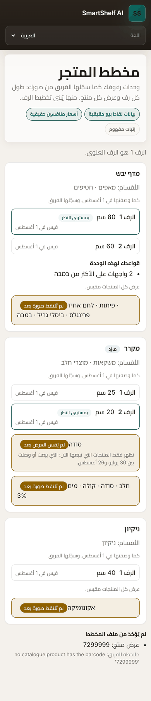 | 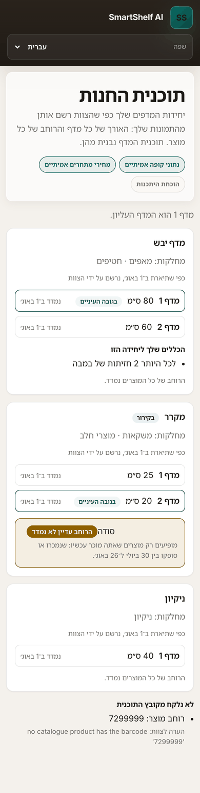 |

#### With pictures

Store layout lists, per unit, the products whose picture has not been taken yet, as it lists those without a width (FR-217). Drawn TEST pictures.

| العربية | עברית |
|---|---|
| 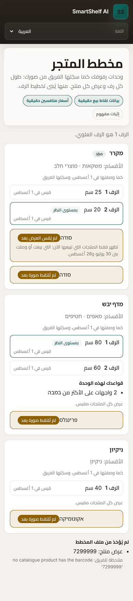 | 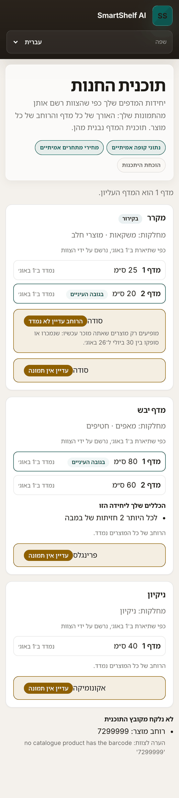 |

#### Today: no layout file

The reason in his words (AC-172), and what to send.

| العربية | עברית |
|---|---|
| 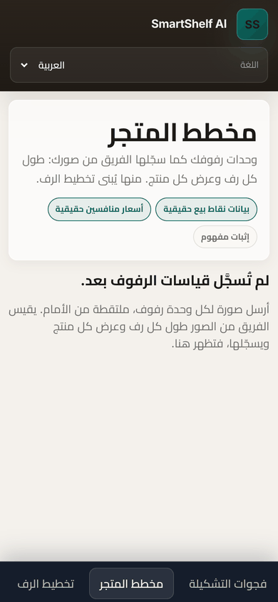 | 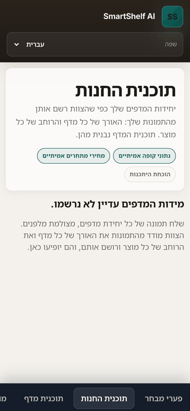 |

#### Every unit in the file rejected

Each rejected unit named, with the team's note.

| العربية | עברית |
|---|---|
| 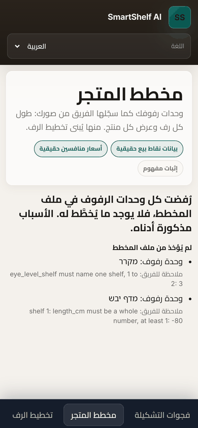 | 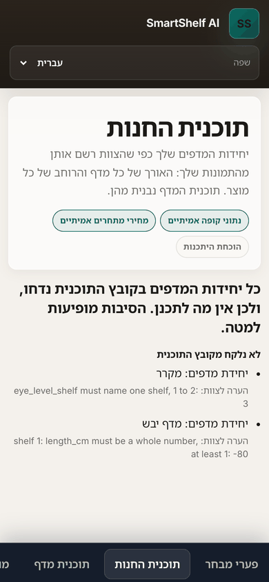 |

### Shelf plan

#### Filled

The plan's window, and the elasticity it uses and why. Per unit: the unit from the front, its shelves stacked, every facing a tile as wide as the product with its number, then the free length; the key, with each product's shelf, facings and earnings rank and his rule where one applies; the products not on the plan and why, why no extra facings were given, the dates of the facts used, the AI's explanation (illustrative on the fridge, held back on the dry unit, out of date on the cleaning unit), and "I've arranged this shelf".

| العربية | עברית |
|---|---|
| 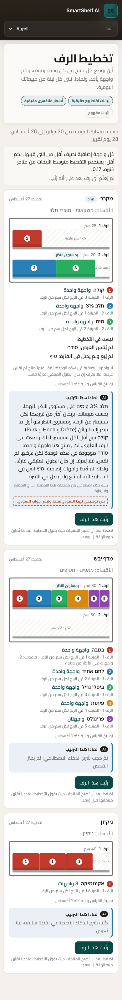 | 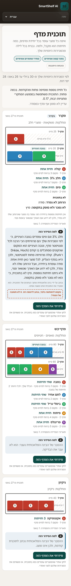 |

#### After "I've arranged this shelf"

This device's record, with its date and Undo, until the nightly publishes it (ADR-038 Decision 6).

| العربية | עברית |
|---|---|
| 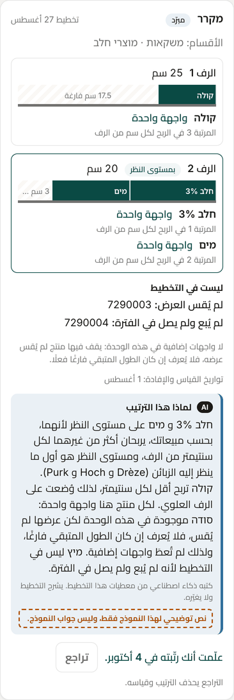 | 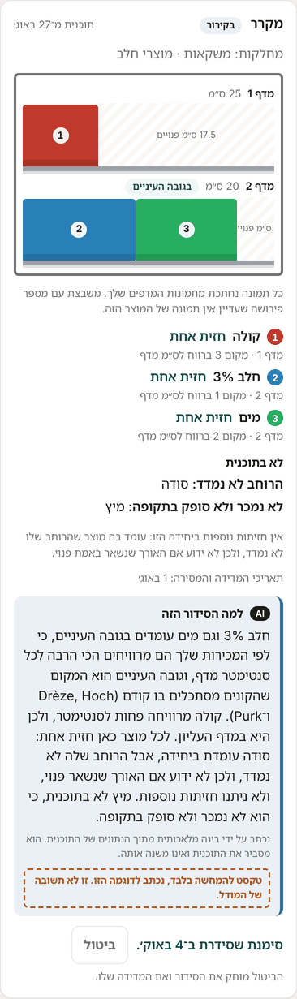 |

#### With pictures: the dry unit

Each facing shows the product's picture, with its number in the corner for the key; the Pringles have no picture yet and keep their numbered tile (D-33, FR-217). Drawn TEST pictures, labelled on the page.

| العربية | עברית |
|---|---|
| 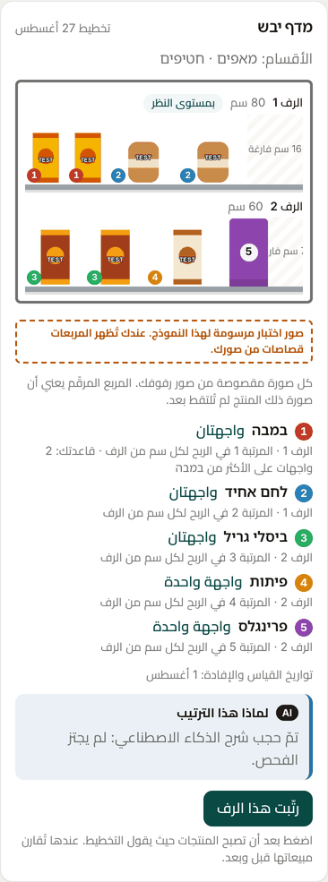 | 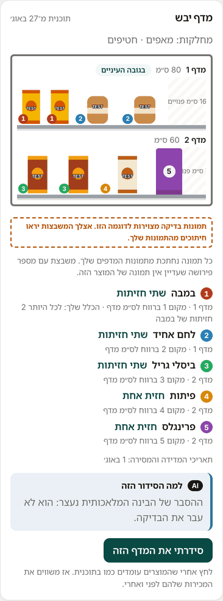 |

#### With pictures: the fridge

The same on a chilled unit. Drawn TEST pictures, labelled on the page.

| العربية | עברית |
|---|---|
| 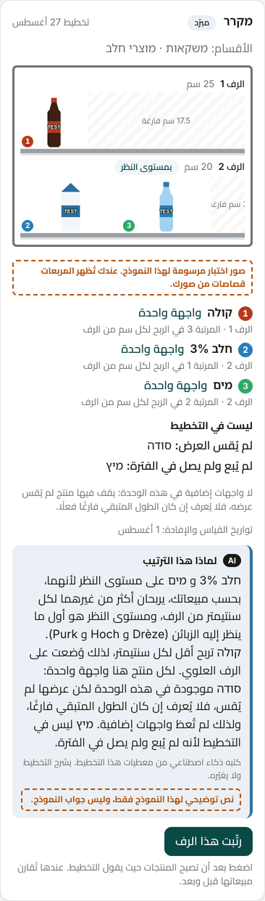 | 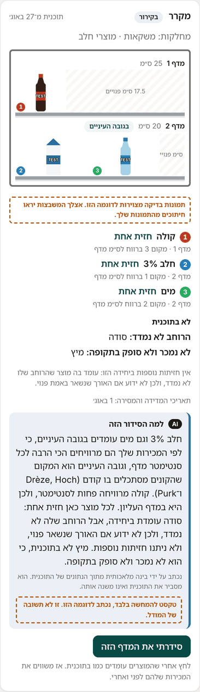 |

#### When his store's own figure is in use

The plan says it uses his store's measured figure.

| العربية | עברית |
|---|---|
| 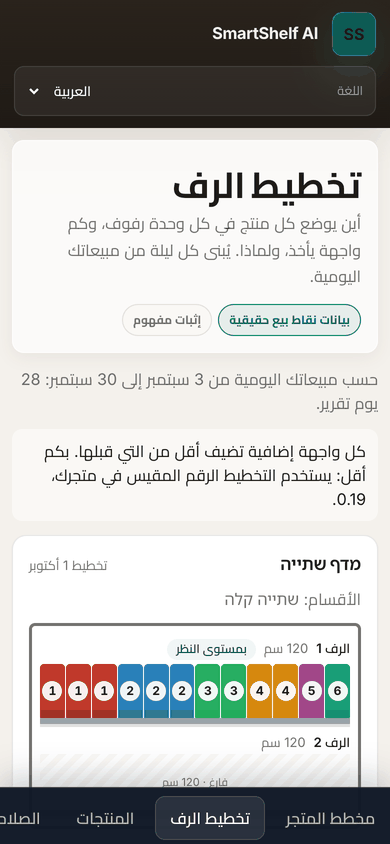 | 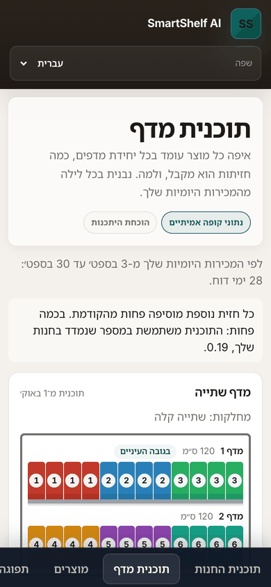 |

#### A unit whose arrangement was measured

The two windows, then per product: facings before and after, a move to or off eye level, units sold per day before and after, and the change net of the rest of the store. No product gets a verdict (FR-203). Then the published arrangement with Undo, and the button for tonight's plan.

| العربية | עברית |
|---|---|
| 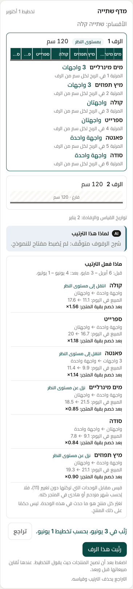 | 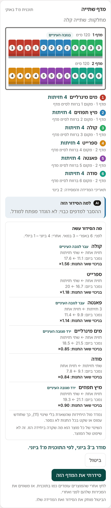 |

#### A unit whose measurement is still running

How many report days so far, of the number needed, and when the after window ends. The warning that arranging it again ends that measurement (FR-201).

| العربية | עברית |
|---|---|
| 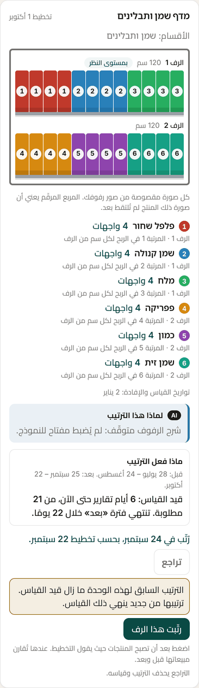 | 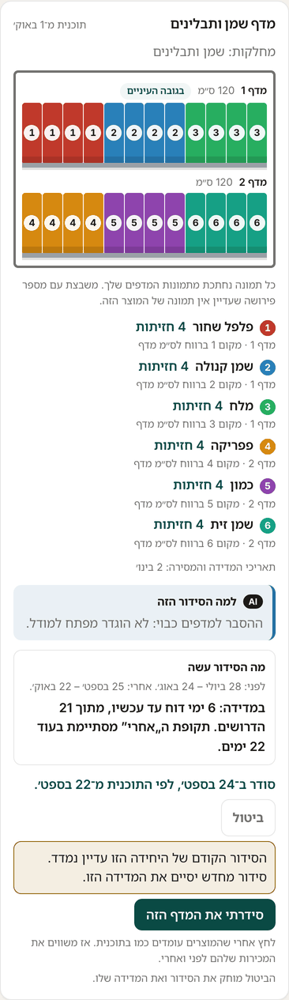 |

#### His store's own figure

The figure with its interval, the verdict, how many arrangements, units and products it rests on, the check for earlier trends, and the research average beside it.

| العربية | עברית |
|---|---|
| 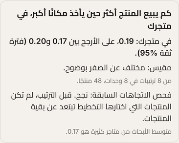 | 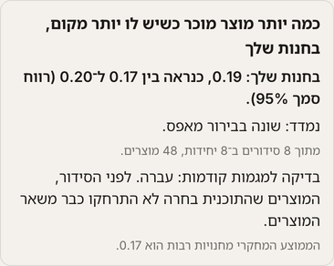 |

#### Today: no layout file

The reason in his words, what to send, and "See how this page looks" (FR-200).

| العربية | עברית |
|---|---|
| 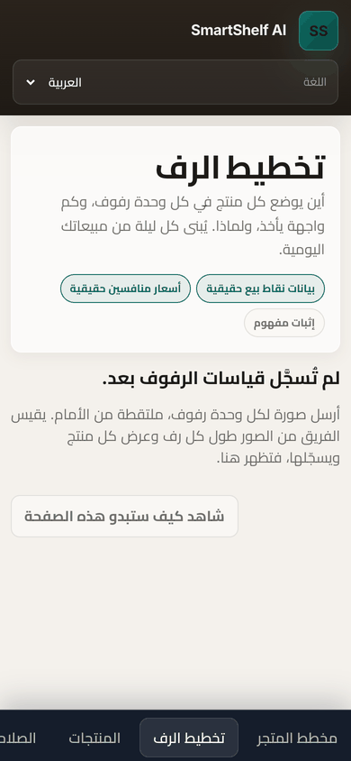 | 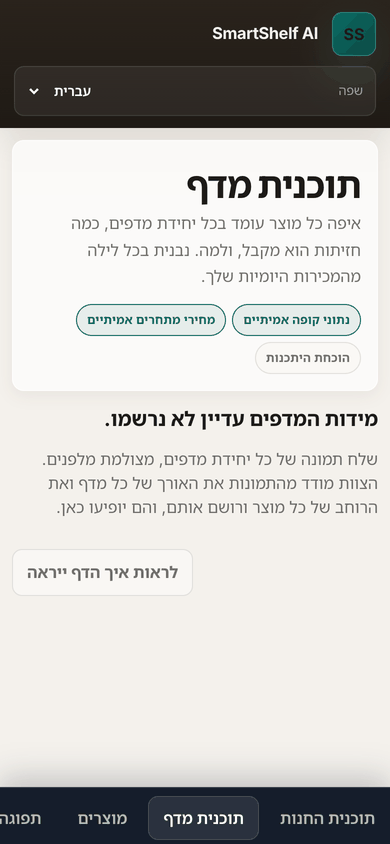 |

#### The example, opened

The same page from the test shop, inside the amber frame and banner, every unit tagged "Example" and every button disabled (D-31).

| العربية | עברית |
|---|---|
| 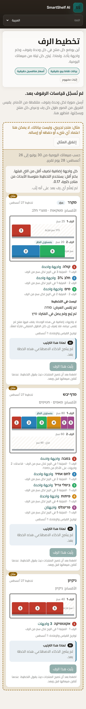 | 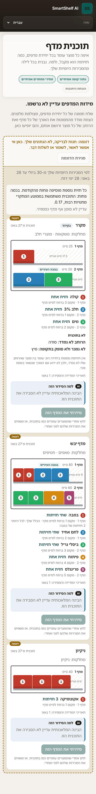 |

#### Layout recorded, no daily reports yet

Shelf plan waits the way Reorder does (AC-173, D-30).

| العربية | עברית |
|---|---|
| 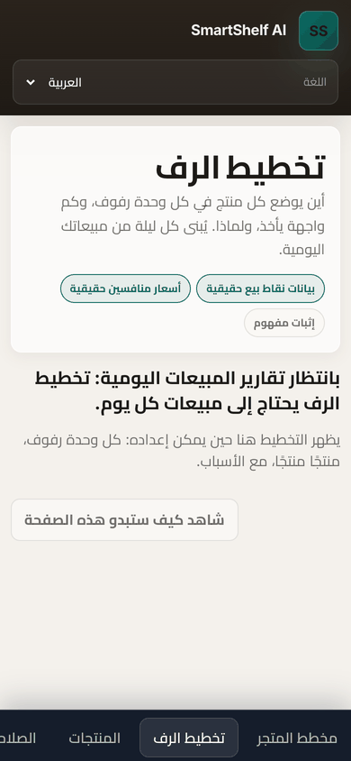 | 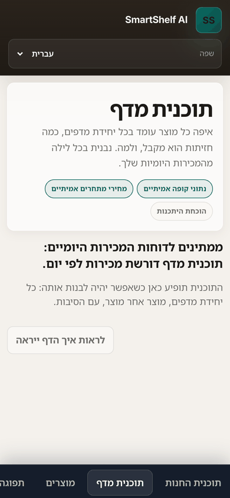 |

#### The team account

The read-only banner, and the button disabled (ADR-029, AC-182).

| العربية | עברית |
|---|---|
| 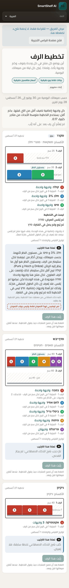 | 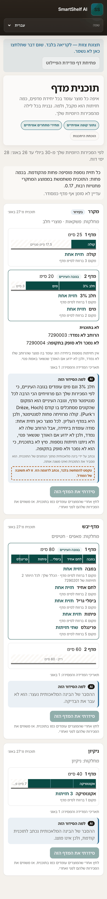 |

## The new wording

Every phrase the two pages add or change, as the dictionaries hold it on the branch. The four page texts come first; the rest are new.

| Key | English | עברית | العربية |
|---|---|---|---|
| `page.store-layout.hint` | Your shelves, as measured | המדפים שלך, כפי שנמדדו | رفوفك كما قيست |
| `page.store-layout.title` | Store layout | תוכנית החנות | مخطط المتجر |
| `page.store-layout.description` | Your shelf units as the team recorded them from your photos: each shelf’s length, and each product’s width. Shelf plan is made from these. | יחידות המדפים שלך כפי שהצוות רשם אותן מהתמונות שלך: האורך של כל מדף והרוחב של כל מוצר. תוכנית המדף נבנית מהן. | وحدات رفوفك كما سجّلها الفريق من صورك: طول كل رف وعرض كل منتج. منها يُبنى تخطيط الرف. |
| `page.shelf-plan.description` | Where each product goes on each shelf unit, how many facings it gets, and why. Made each night from your own daily sales. | איפה כל מוצר עומד בכל יחידת מדפים, כמה חזיתות הוא מקבל, ולמה. נבנית בכל לילה מהמכירות היומיות שלך. | أين يوضع كل منتج في كل وحدة رفوف، وكم واجهة يأخذ، ولماذا. يُبنى كل ليلة من مبيعاتك اليومية. |
| `unavailable.layout_facts.layout_all_rejected` | Every shelf unit in the layout file was rejected, so nothing can be planned. The reasons are below. | כל יחידות המדפים בקובץ התוכנית נדחו, ולכן אין מה לתכנן. הסיבות מופיעות למטה. | رُفضت كل وحدات الرفوف في ملف المخطط، فلا يوجد ما يُخطَّط له. الأسباب مذكورة أدناه. |
| `layout.waiting.next` | Send a photo of each shelf unit, taken from the front. The team measures each shelf and each product’s width from the photos and records them, and they appear here. | שלח תמונה של כל יחידת מדפים, מצולמת מלפנים. הצוות מודד מהתמונות את האורך של כל מדף ואת הרוחב של כל מוצר ורושם אותם, והם יופיעו כאן. | أرسل صورة لكل وحدة رفوف، ملتقطة من الأمام. يقيس الفريق من الصور طول كل رف وعرض كل منتج ويسجّلها، فتظهر هنا. |
| `layout.shelfOrder` | Shelf 1 is the top shelf. | מדף 1 הוא המדף העליון. | الرف 1 هو الرف العلوي. |
| `layout.chilled` | Chilled | בקירור | مبرّد |
| `layout.departments` | Departments: | מחלקות: | الأقسام: |
| `layout.stated` | As you described it on {date}, recorded by the team | כפי שתיארת ב־{date}, נרשם על ידי הצוות | كما وصفتها في {date}، وسجّلها الفريق |
| `layout.shelf` | Shelf {n} | מדף {n} | الرف {n} |
| `layout.length` | {cm} cm | {cm} ס״מ | {cm} سم |
| `layout.widthMm` | {mm} mm | {mm} מ״מ | {mm} مم |
| `layout.measured` | measured {date} | נמדד ב־{date} | قيس في {date} |
| `layout.eyeLevel` | Eye level | בגובה העיניים | بمستوى النظر |
| `layout.rules` | Your rules for this unit | הכללים שלך ליחידה הזו | قواعدك لهذه الوحدة |
| `layout.noWidth` | Width not measured yet | הרוחב עדיין לא נמדד | لم يُقس العرض بعد |
| `layout.allMeasured` | Every product’s width is measured. | הרוחב של כל המוצרים נמדד. | عرض كل المنتجات مقيس. |
| `layout.counting.planned` | Only products you sell now are listed: sold or delivered between {first} and {last}. | מופיעים רק מוצרים שאתה מוכר עכשיו: שנמכרו או סופקו בין {first} ל־{last}. | تظهر فقط المنتجات التي تبيعها الآن: التي بيعت أو وصلت بين {first} و{last}. |
| `layout.counting.catalogue` | No daily sales yet, so every catalogue product of these departments is listed. | עדיין אין מכירות יומיות, ולכן מופיע כל מוצר בקטלוג של המחלקות האלה. | لا توجد مبيعات يومية بعد، لذلك يظهر كل منتج في الكتالوج من هذه الأقسام. |
| `layout.unplanned.stock_unknown` | Stock count unknown, so not planned | ספירת המלאי לא ידועה, ולכן לא תוכנן | جرد المخزون غير معروف، فلم يُخطَّط له |
| `layout.unplanned.rejected` | On two units, and no rule says which | בשתי יחידות, ואין כלל שאומר באיזו | في وحدتين، ولا قاعدة تحدد أيّهما |
| `layout.noFixture` | Departments on no shelf unit | מחלקות שאינן באף יחידת מדפים | أقسام ليست في أي وحدة رفوف |
| `layout.rejected` | Not used from the layout file | לא נלקח מקובץ התוכנית | لم يُؤخذ من ملف المخطط |
| `layout.rejected.kind.file` | The whole file | הקובץ כולו | الملف كله |
| `layout.rejected.kind.fixture` | Shelf unit | יחידת מדפים | وحدة رفوف |
| `layout.rejected.kind.width` | Product width | רוחב מוצר | عرض منتج |
| `layout.rejected.kind.rule` | Rule | כלל | قاعدة |
| `layout.rejected.kind.current` | Current facings | החזיתות הנוכחיות | الواجهات الحالية |
| `layout.rejected.kind.department` | Department | מחלקה | قسم |
| `layout.rejected.kind.product` | Product | מוצר | منتج |
| `layout.noPicture` | Picture not taken yet | עדיין אין תמונה | لم تُلتقط صورة بعد |
| `layout.allPictured` | Every product has its picture. | לכל המוצרים יש תמונה. | لكل المنتجات صورها. |
| `layout.rejected.kind.picture` | Product picture | תמונת מוצר | صورة منتج |
| `shelf.pictures.missing` | Each picture is cut from your own shelf photos. A numbered tile means that product's picture has not been taken yet. | כל תמונה נחתכת מתמונות המדפים שלך. משבצת עם מספר פירושה שעדיין אין תמונה של המוצר הזה. | كل صورة مقصوصة من صور رفوفك. المربع المرقّم يعني أن صورة ذلك المنتج لم تُلتقط بعد. |
| `layout.rejected.teamNote` | Note for the team: | הערה לצוות: | ملاحظة للفريق: |
| `shelf.rule.together` | Keep together on one shelf: {names} | לשמור יחד על מדף אחד: {names} | إبقاؤها معًا على رف واحد: {names} |
| `shelf.rule.togetherDepartment` | Keep the {department} department together on one shelf | לשמור את מחלקת {department} יחד על מדף אחד | إبقاء قسم {department} معًا على رف واحد |
| `shelf.rule.keep_on` | Keep {name} on this unit | להשאיר את {name} ביחידה הזו | إبقاء {name} في هذه الوحدة |
| `shelf.rule.keep_off` | Keep {name} off this unit | לא לשים את {name} ביחידה הזו | إبعاد {name} عن هذه الوحدة |
| `shelf.rule.at_least` | At least {n} facings of {name} | לפחות {n} חזיתות של {name} | {n} واجهات على الأقل من {name} |
| `shelf.rule.at_most` | At most {n} facings of {name} | לכל היותר {n} חזיתות של {name} | {n} واجهات على الأكثر من {name} |
| `shelf.waiting.next` | The plan appears here when it can be made: each shelf unit, product by product, with the reasons. | התוכנית תופיע כאן כשאפשר יהיה לבנות אותה: כל יחידת מדפים, מוצר אחר מוצר, עם הסיבות. | يظهر التخطيط هنا حين يمكن إعداده: كل وحدة رفوف، منتجًا منتجًا، مع الأسباب. |
| `shelf.elasticity.research` | Each extra facing adds less than the one before. How much less: the plan uses the research average across many shops, {value}. | כל חזית נוספת מוסיפה פחות מהקודמת. בכמה פחות: התוכנית משתמשת בממוצע המחקרי מחנויות רבות, {value}. | كل واجهة إضافية تضيف أقل من التي قبلها. بكم أقل: يستخدم التخطيط متوسط الأبحاث من متاجر كثيرة، {value}. |
| `shelf.elasticity.his` | Each extra facing adds less than the one before. How much less: the plan uses your store’s own measured figure, {value}. | כל חזית נוספת מוסיפה פחות מהקודמת. בכמה פחות: התוכנית משתמשת במספר שנמדד בחנות שלך, {value}. | كل واجهة إضافية تضيف أقل من التي قبلها. بكم أقل: يستخدم التخطيط الرقم المقيس في متجرك، {value}. |
| `shelf.elasticity.why.his_own_not_yet_measured` | Your store’s own figure is not measured yet. | המספר של החנות שלך עדיין לא נמדד. | رقم متجرك لم يُقس بعد. |
| `shelf.elasticity.why.his_own_not_significant` | Your store’s own figure is not yet clear enough to use. | המספר של החנות שלך עדיין לא ברור מספיק כדי להשתמש בו. | رقم متجرك ليس واضحًا بما يكفي لاستخدامه بعد. |
| `shelf.elasticity.why.his_own_outside_range` | Your store’s own figure came out outside the range the plan can use. | המספר של החנות שלך יצא מחוץ לטווח שהתוכנית יכולה להשתמש בו. | جاء رقم متجرك خارج المدى الذي يستطيع التخطيط استخدامه. |
| `shelf.elasticity.why.placebo_not_run` | Your store’s own figure is measured, but the check for earlier trends has not run yet. | המספר של החנות שלך נמדד, אבל הבדיקה למגמות קודמות עוד לא רצה. | رقم متجرك مقيس، لكن فحص الاتجاهات السابقة لم يُجرَ بعد. |
| `shelf.elasticity.why.placebo_failed` | Your store’s own figure failed the check for earlier trends. | המספר של החנות שלך לא עבר את הבדיקה למגמות קודמות. | رقم متجرك لم يجتز فحص الاتجاهات السابقة. |
| `shelf.planOf` | Plan of {date} | תוכנית מ־{date} | تخطيط {date} |
| `shelf.free` | {cm} cm free | {cm} ס״מ פנויים | {cm} سم فارغة |
| `shelf.empty` | Empty · {cm} cm | ריק · {cm} ס״מ | فارغ · {cm} سم |
| `shelf.rank` | No. {rank} in earnings per cm of shelf | מקום {rank} ברווח לס״מ מדף | المرتبة {rank} في الربح لكل سم من الرف |
| `shelf.unknown` | Earnings unknown ({why}): one facing, no more | הרווח לא ידוע ({why}): חזית אחת, לא יותר | الربح غير معروف ({why}): واجهة واحدة لا أكثر |
| `shelf.unknown.no_shelf_price` | no shelf price | אין מחיר מדף | لا سعر رف |
| `shelf.unknown.no_unit_cost` | no unit cost | אין עלות ליחידה | لا تكلفة للوحدة |
| `shelf.unknown.demand_unknown` | sales not itemised | המכירות לא מפורטות | المبيعات غير مفصّلة |
| `shelf.and` | ,  | ,  | ،  |
| `shelf.keptOn` | On this unit by your rule | ביחידה הזו לפי הכלל שלך | في هذه الوحدة بحسب قاعدتك |
| `shelf.yourRule` | Your rule: {rule} | הכלל שלך: {rule} | قاعدتك: {rule} |
| `shelf.unplaced` | Not on the plan | לא בתוכנית | ليست في التخطيط |
| `shelf.unplaced.no_width` | Width not measured: | הרוחב לא נמדד: | لم يُقس العرض: |
| `shelf.unplaced.too_wide` | Wider than every shelf: | רחב מכל מדף: | أعرض من كل رف: |
| `shelf.unplaced.no_sale_in_window` | No sale or delivery in the window: | לא נמכר ולא סופק בתקופה: | لم يُبع ولم يصل في الفترة: |
| `shelf.unplaced.count_zero_or_below` | Stock count zero or below: | ספירת מלאי אפס או פחות: | جرد المخزون صفر أو أقل: |
| `shelf.unplaced.stock_unknown` | Stock count unknown: | ספירת המלאי לא ידועה: | جرد المخزون غير معروف: |
| `shelf.unplaced.kept_off` | Kept off by your rule: | מחוץ ליחידה לפי הכלל שלך: | خارج هذه الوحدة بحسب قاعدتك: |
| `shelf.unplaced.rejected` | On two units, and no rule says which: | בשתי יחידות, ואין כלל שאומר באיזו: | في وحدتين، ولا قاعدة تحدد أيّهما: |
| `shelf.extras.no_width` | No extra facings on this unit: a product whose width is not measured stands on it, so the spare length is not known to be free. | אין חזיתות נוספות ביחידה הזו: עומד בה מוצר שהרוחב שלו לא נמדד, ולכן לא ידוע אם האורך שנשאר באמת פנוי. | لا واجهات إضافية في هذه الوحدة: يقف فيها منتج لم يُقس عرضه، فلا يُعرف إن كان الطول المتبقي فارغًا فعلًا. |
| `shelf.extras.too_wide` | No extra facings on this unit: a product wider than its shelves stands on it, so the spare length is not known to be free. | אין חזיתות נוספות ביחידה הזו: עומד בה מוצר רחב מהמדפים שלה, ולכן לא ידוע אם האורך שנשאר באמת פנוי. | لا واجهات إضافية في هذه الوحدة: يقف فيها منتج أعرض من رفوفها، فلا يُعرف إن كان الطول المتبقي فارغًا فعلًا. |
| `shelf.factsOf` | Measured or stated on: {dates} | תאריכי המדידה והמסירה: {dates} | تواريخ القياس والإفادة: {dates} |
| `shelf.noPlan` | No plan | אין תוכנית | لا تخطيط |
| `shelf.state.over_full` | Even at one facing each, this unit’s products do not fit: {cm} cm too many. Which one leaves is your choice: a rule that keeps one off this unit, or a longer shelf. The products: | גם בחזית אחת לכל מוצר, המוצרים של היחידה הזו לא נכנסים: {cm} ס״מ יותר מדי. איזה מוצר יוצא זו החלטה שלך: כלל שמוציא מוצר מהיחידה, או מדף ארוך יותר. המוצרים: | حتى بواجهة واحدة لكل منتج، لا تتسع هذه الوحدة لمنتجاتها: {cm} سم زيادة. أيّ منتج يخرج قرارك أنت: قاعدة تُبعد منتجًا عن الوحدة، أو رف أطول. المنتجات: |
| `shelf.state.stopped_by_rule` | Your rule “{rule}” cannot be met: {why}. | אי אפשר לקיים את הכלל שלך „{rule}”: {why}. | لا يمكن الالتزام بقاعدتك «{rule}»: {why}. |
| `shelf.state.no_planned_products` | Nothing on this unit sold or was delivered in the window, so there is nothing to plan. | שום מוצר ביחידה הזו לא נמכר ולא סופק בתקופה, ולכן אין מה לתכנן. | لم يُبع ولم يصل أي منتج من هذه الوحدة في الفترة، فلا يوجد ما يُخطَّط له. |
| `shelf.state.nothing_placeable` | None of this unit’s products can be placed yet. Why is listed below. | עדיין אי אפשר להציב אף אחד מהמוצרים של היחידה הזו. הסיבות מופיעות למטה. | لا يمكن بعد وضع أي من منتجات هذه الوحدة. الأسباب أدناه. |
| `shelf.stopped.no_width` | the product’s width is not measured | הרוחב של המוצר לא נמדד | عرض المنتج لم يُقس |
| `shelf.stopped.too_wide` | the product is wider than every shelf | המוצר רחב מכל מדף | المنتج أعرض من كل رف |
| `shelf.stopped.product_not_planned` | the product is not sold now | המוצר לא נמכר עכשיו | المنتج لا يُباع الآن |
| `shelf.stopped.product_not_placed` | the product is not placed on this unit | המוצר לא מוצב ביחידה הזו | المنتج غير موضوع في هذه الوحدة |
| `shelf.stopped.conflicts_with_at_most` | it asks for more facings than your “at most” rule allows | הוא מבקש יותר חזיתות ממה שהכלל „לכל היותר” שלך מתיר | تطلب واجهات أكثر مما تسمح به قاعدتك «على الأكثر» |
| `shelf.stopped.products_on_another_fixture` | some of its products are planned on another unit | חלק מהמוצרים שלו מתוכננים ביחידה אחרת | بعض منتجاتها مخطَّط لها في وحدة أخرى |
| `shelf.stopped.longer_than_any_shelf` | together they are longer than any shelf | יחד הם ארוכים מכל מדף | معًا أطول من أي رف |
| `shelf.stopped.sizes_unknown` | a product whose width is not measured stands on this unit, so no spare length is known | עומד ביחידה מוצר שהרוחב שלו לא נמדד, ולכן לא ידוע כמה אורך פנוי | يقف في الوحدة منتج لم يُقس عرضه، فلا يُعرف كم من الطول فارغ |
| `shelf.stopped.earnings_unknown` | the product’s earnings are unknown, so it gets one facing only | הרווח של המוצר לא ידוע, ולכן הוא מקבל חזית אחת בלבד | ربح المنتج غير معروف، فيأخذ واجهة واحدة فقط |
| `shelf.stopped.does_not_fit` | there is no room on its shelf for that many facings | אין במדף שלו מקום לכל כך הרבה חזיתות | لا مكان على رفه لهذا العدد من الواجهات |
| `shelf.arrange` | I’ve arranged this shelf | סידרתי את המדף הזה | رتّبت هذا الرف |
| `shelf.arrange.how` | Press it once the products stand where this plan says. Their sales are then compared before and after. | לחץ אחרי שהמוצרים עומדים כמו בתוכנית. אז משווים את המכירות שלהם לפני ואחרי. | اضغط بعد أن تصبح المنتجات حيث يقول التخطيط. عندها تُقارن مبيعاتها قبل وبعد. |
| `shelf.arrange.ends` | This unit’s last arrangement is still being measured. Arranging it again ends that measurement. | הסידור הקודם של היחידה הזו עדיין נמדד. סידור מחדש יסיים את המדידה הזו. | الترتيب السابق لهذه الوحدة ما زال قيد القياس. ترتيبها من جديد ينهي ذلك القياس. |
| `shelf.arranged.mine` | You marked it arranged on {date}. | סימנת שסידרת ב־{date}. | علّمت أنك رتّبته في {date}. |
| `shelf.arranged.published` | Arranged on {date}, to the plan of {plan}. | סודר ב־{date}, לפי התוכנית מ־{plan}. | رُتّب في {date}، بحسب تخطيط {plan}. |
| `shelf.undo` | Undo | ביטול | تراجع |
| `shelf.undo.what` | Undo removes the arrangement and its measurement. | הביטול מוחק את הסידור ואת המדידה שלו. | التراجع يحذف الترتيب وقياسه. |
| `shelfExplanation.tag` | AI | AI | AI |
| `shelfExplanation.label` | Why this arrangement | למה הסידור הזה | لماذا هذا الترتيب |
| `shelfExplanation.note` | Written by an AI from this plan’s facts. It explains the plan and does not change it. | נכתב על ידי בינה מלאכותית מתוך הנתונים של התוכנית. הוא מסביר את התוכנית ואינו משנה אותה. | كتبه ذكاء اصطناعي من معطيات هذا التخطيط. يشرح التخطيط ولا يغيّره. |
| `shelf.measure.title` | What the arrangement did | מה הסידור עשה | ماذا فعل الترتيب |
| `shelf.measure.windows` | Before: {b1} – {b2}. After: {a1} – {a2}. | לפני: {b1} – {b2}. אחרי: {a1} – {a2}. | قبل: {b1} – {b2}. بعد: {a1} – {a2}. |
| `shelf.measure.waiting` | Being measured: {so} report days so far, of the {need} needed. The after window ends in {days}. | במדידה: {so} ימי דוח עד עכשיו, מתוך {need} הדרושים. תקופת ה„אחרי” מסתיימת בעוד {days}. | قيد القياس: {so} أيام تقارير حتى الآن، من {need} مطلوبة. تنتهي فترة «بعد» خلال {days}. |
| `shelf.measure.not.rearranged_again` | Not measurable: the unit was arranged again before its measurement ended. | אי אפשר למדוד: היחידה סודרה שוב לפני שהמדידה הסתיימה. | لا يمكن القياس: رُتّبت الوحدة مرة أخرى قبل انتهاء قياسها. |
| `shelf.measure.not.history_too_short` | Not measurable: the daily reports do not go back far enough before the plan. | אי אפשר למדוד: הדוחות היומיים לא מגיעים מספיק אחורה לפני התוכנית. | لا يمكن القياس: التقارير اليومية لا تعود بما يكفي إلى ما قبل التخطيط. |
| `shelf.measure.not.after_window_too_thin` | Not measurable: too few daily reports arrived after the arranging. | אי אפשר למדוד: הגיעו מעט מדי דוחות יומיים אחרי הסידור. | لا يمكن القياس: وصلت تقارير يومية قليلة جدًا بعد الترتيب. |
| `shelf.measure.not.no_unchanged_fixture` | Not measurable: no unit was left as it was, to compare with. | אי אפשר למדוד: לא נשארה יחידה בלי שינוי להשוואה. | لا يمكن القياس: لم تبقَ وحدة دون تغيير للمقارنة. |
| `shelf.measure.not.comparison_did_not_sell` | Not measurable: the units left as they were sold nothing in one of the windows. | אי אפשר למדוד: היחידות שנשארו בלי שינוי לא מכרו כלום באחת התקופות. | لا يمكن القياس: الوحدات التي بقيت دون تغيير لم تبع شيئًا في إحدى الفترتين. |
| `shelf.measure.change` | {before} → {after} | {before} ← {after} | {before} ← {after} |
| `shelf.measure.perDay` | Sold per day: {change} | נמכר ביום: {change} | المبيع في اليوم: {change} |
| `shelf.measure.net` | Net of the rest of the store: {x} | בניכוי שאר החנות: {x} | بعد خصم بقية المتجر: {x} |
| `shelf.measure.noNet` | Net change: {why} | שינוי נטו: {why} | التغيّر الصافي: {why} |
| `shelf.measure.toEye` | moved to eye level | עבר לגובה העיניים | انتقل إلى مستوى النظر |
| `shelf.measure.offEye` | moved off eye level | ירד מגובה העיניים | نزل عن مستوى النظر |
| `shelf.measure.noRatio.no_sale_in_before_window` | no sale before | לא נמכר לפני | لا مبيع قبل |
| `shelf.measure.noRatio.could_not_be_fitted` | not computed | לא חושב | لم يُحسب |
| `shelf.measure.against` | Measured against the units you left as they were ({n}), so a busy or quiet month in the whole store is taken out. | נמדד מול היחידות שהשארת בלי שינוי ({n}), כך שחודש עמוס או שקט בכל החנות לא נספר. | قيس مقابل الوحدات التي تركتها دون تغيير ({n})، فلا يُحسب شهر مزدحم أو هادئ في المتجر كله. |
| `shelf.measure.noVerdict` | Each product’s change is what happened on this unit. It is not a verdict on that product. | השינוי של כל מוצר הוא מה שקרה ביחידה הזו. זה לא שיפוט של המוצר. | تغيّر كل منتج هو ما حدث في هذه الوحدة. ليس حكمًا على ذلك المنتج. |
| `shelf.measure.leftOut` | Left out, because they did not sell in the plan’s window: | לא נכללו, כי לא נמכרו בתקופת התוכנית: | لم تُحسب، لأنها لم تُبع في فترة التخطيط: |
| `shelf.store.title` | How much more a product sells with more space, in your store | כמה יותר מוצר מוכר כשיש לו יותר מקום, בחנות שלך | كم يبيع المنتج أكثر حين يأخذ مكانًا أكبر، في متجرك |
| `shelf.store.estimate` | Your store: {value}, most likely between {lo} and {hi} ({level} interval). | בחנות שלך: {value}, כנראה בין {lo} ל־{hi} (רווח סמך {level}). | في متجرك: {value}، على الأرجح بين {lo} و{hi} (فترة ثقة {level}). |
| `shelf.store.verdict.measured` | Measured: clearly different from zero. | נמדד: שונה בבירור מאפס. | مقيس: مختلف عن الصفر بوضوح. |
| `shelf.store.verdict.measured_and_not_significant` | Not clear yet: it could still be zero. | עדיין לא ברור: ייתכן שזה עדיין אפס. | ليس واضحًا بعد: قد يكون صفرًا. |
| `shelf.store.verdict.not_measurable` | Not measurable yet: {why}. | עדיין אי אפשר למדוד: {why}. | لا يمكن قياسه بعد: {why}. |
| `shelf.store.whyNot.too_few_arrangements_or_products` | it needs at least {a} arrangements and {p} products | צריך לפחות {a} סידורים ו־{p} מוצרים | يحتاج إلى {a} ترتيبات و{p} منتجًا على الأقل |
| `shelf.store.whyNot.no_comparison` | no unit was left as it was, to compare with | לא נשארה יחידה בלי שינוי להשוואה | لم تبقَ وحدة دون تغيير للمقارنة |
| `shelf.store.whyNot.no_variation_in_facings` | every arranged product’s facings changed in the same proportion | החזיתות של כל המוצרים שסודרו השתנו באותו יחס | تغيّرت واجهات كل المنتجات المرتّبة بالنسبة نفسها |
| `shelf.store.whyNot.placebo_failed` | the products the plan chose were already moving apart before the arranging | המוצרים שהתוכנית בחרה כבר התרחקו מהשאר לפני הסידור | المنتجات التي اختارها التخطيط كانت تبتعد عن البقية قبل الترتيب |
| `shelf.store.whyNot.could_not_be_fitted` | the calculation could not be completed | החישוב לא הושלם | لم يكتمل الحساب |
| `shelf.store.whyNot.too_few_fixtures_to_resample` | too few units to tell how sure the figure is | יש מעט מדי יחידות כדי לדעת כמה המספר בטוח | الوحدات قليلة جدًا لمعرفة مدى دقة الرقم |
| `shelf.store.whyNot.no_arranged_product` | no arranged product could be measured | אף מוצר שסודר לא ניתן למדידה | لا يمكن قياس أي منتج مرتّب |
| `shelf.store.whyNot.history_too_short` | the daily reports do not go back far enough | הדוחות היומיים לא מגיעים מספיק אחורה | التقارير اليومية لا تعود بما يكفي |
| `shelf.store.basis` | From {a} arrangements on {f} units, {p} products. | מתוך {a} סידורים ב־{f} יחידות, {p} מוצרים. | من {a} ترتيبات في {f} وحدات، {p} منتجًا. |
| `shelf.store.placebo.passed` | Check for earlier trends: passed. Before the arranging, the products the plan chose were not already moving apart from the rest. | בדיקה למגמות קודמות: עברה. לפני הסידור, המוצרים שהתוכנית בחרה לא התרחקו כבר משאר המוצרים. | فحص الاتجاهات السابقة: نجح. قبل الترتيب، لم تكن المنتجات التي اختارها التخطيط تبتعد عن بقية المنتجات. |
| `shelf.store.placebo.failed` | Check for earlier trends: failed. The products the plan chose were already moving apart before the arranging, so the figure is not used. | בדיקה למגמות קודמות: נכשלה. המוצרים שהתוכנית בחרה כבר התרחקו מהשאר לפני הסידור, ולכן המספר לא בשימוש. | فحص الاتجاهات السابقة: فشل. المنتجات التي اختارها التخطيط كانت تبتعد عن البقية قبل الترتيب، فلا يُستخدم الرقم. |
| `shelf.store.placebo.not_run` | Check for earlier trends: not run yet ({why}). | בדיקה למגמות קודמות: עוד לא רצה ({why}). | فحص الاتجاهات السابقة: لم يُجرَ بعد ({why}). |
| `shelf.store.research` | The research average across many shops is {value}. | הממוצע המחקרי מחנויות רבות הוא {value}. | متوسط الأبحاث من متاجر كثيرة هو {value}. |

## His answer

- **2026-10-04**, shown the first screens, before accepting: the planogram "should look like this
  but customized to the store that take picture of the shelf", with a picture of a printed
  planogram. The screens were redrawn as the unit from the front.
- **2026-10-05**, "proceed": the work went on. Recorded as no decision.
- **2026-10-05**, "the picture should be added", to decision 3: **D-33**.

- **2026-10-05**, "approve", to "You can say 'approve all', or name what to change": every item
  as drawn. The screens, A (OQ-1210), ADR-040 and ADR-041 with the reader's values (OQ-1211), the
  wording, and the team's note shown.
