# Your own units, with shelf heights — mockups for approval

> **Approved by the repository owner on 2026-10-08** ("approved"), after seeing them in the app on the
> owner's own machine: every item as drawn, the clearance at 2 cm. Built in Phase 8 Task 8.14.

D-38 (2026-10-08): the owner enters each shelving unit in the app, each shelf's length and height
included, so no one edits the layout file. The reader measures each product's height, and the plan
checks that a product fits under the shelf above. These are the screens, their words, and how it
works ([ADR-044](../architecture/decisions/ADR-044-the-owner-enters-each-unit-and-heights-are-checked.md)).
Nothing here is merged or shown to the store until the owner approves it (F12-S1 C-75).

**How they were made.** They were drawn inside the real app, in the e2e build, at phone size
(390 × 844). The code is on the branch `feat/unit-form`, which is not merged. In these pictures:
- **Save** goes nowhere. It waits 0.4 s and reports success, so that the "saved" state could be
  drawn. Nothing was saved;
- the units, products and plans are the marked example's (`public/examples/shelf-plan-example.json`),
  a test shop, shown as if they were the store's own;
- **the heights are TEST values, written by hand for these pictures.** No engine or reader
  produced them, because neither measures heights until this is approved. Each placed product was
  given a height that fits its shelf. One product, a 4-litre bleach at 38 cm, was added to show
  "taller than every shelf";
- the departments in the "today" pictures are the real catalogue's.

## What the owner is asked to decide

1. **The form**, on Store layout, above the photos. It asks for:
   - the unit's name and departments, and whether it is chilled;
   - the shelves from the top, with each one's length and height;
   - the eye-level shelf.

   A team account sees it disabled.
2. **Heights on the pages:**
   - on Store layout, each shelf's height, and the products whose height is not measured yet;
   - on Shelf plan, the products "taller than every shelf";
   - **the unit drawn to scale**: each shelf as tall as it really is, and each product as tall as
     it really is.
3. **The wording**, in the three languages (table below).
4. **How it works** (ADR-044):
   - what you save is kept with your other decisions in the app. Each night it is written into
     the layout file the engine reads, and its history is kept;
   - the reader measures each product's height from the same photo, at no extra cost. Like the
     widths, the heights are used only after the check on the next store's first photos: about 20
     products measured by hand, each within 5 mm;
   - the plan puts a product only on a shelf it fits under, leaving room to take it out.
5. **That room, the clearance between a product's top and the shelf above: 2 cm.** It is a starting
   value: say another if 2 cm is wrong for your shelves.

**One thing to know.** On a unit with heights, a product is placed only when both its width and its
height are known. Until the reader's check passes, nothing is placed on such a unit. That is
already true of widths today.

## The screens

### Today: no unit described yet

The form is the first thing on Store layout, before any photo is sent.

| العربية | עברית |
|---|---|
| 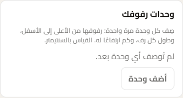 | 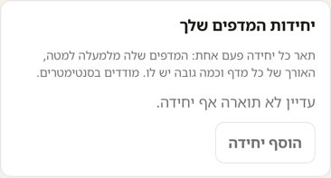 |

### Adding a unit

Departments are chosen from the catalogue's own list, so a name can never be misspelled. The top shelf's height is empty here: nothing is above it.

| العربية | עברית |
|---|---|
| 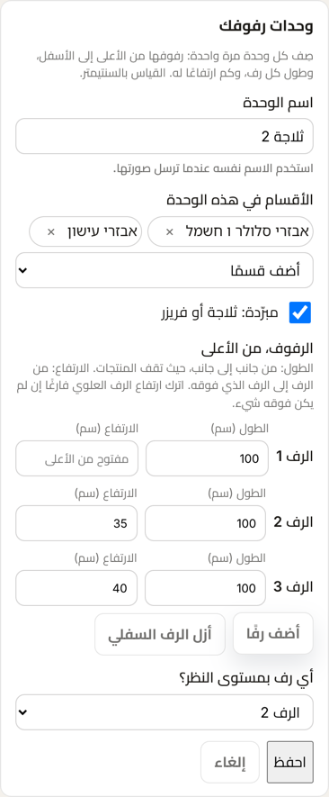 | 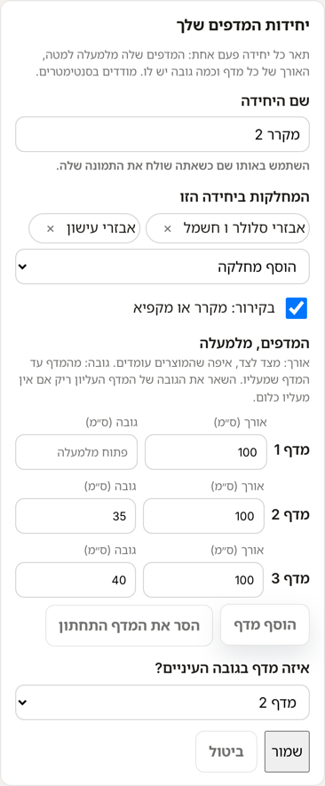 |

### Saved

The new unit is listed with each shelf's size.

| العربية | עברית |
|---|---|
| 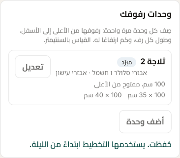 | 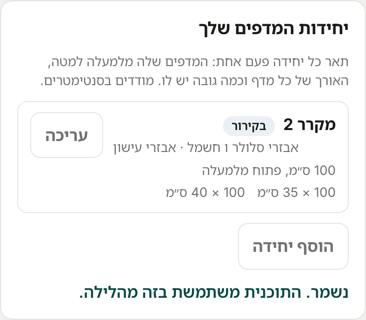 |

### Units described

Each unit with its departments and each shelf's length × height. "Open above" is a top shelf with nothing above it.

| العربية | עברית |
|---|---|
| 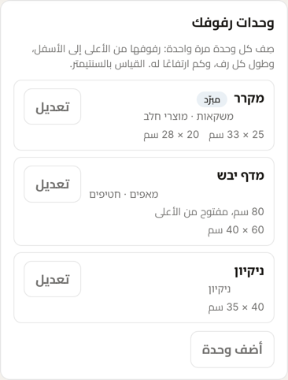 | 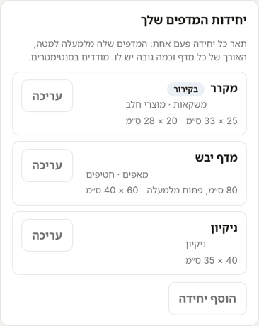 |

### Editing a unit

The same form, with the unit's own values, and "Remove this unit", which asks to be pressed twice.

| العربية | עברית |
|---|---|
| 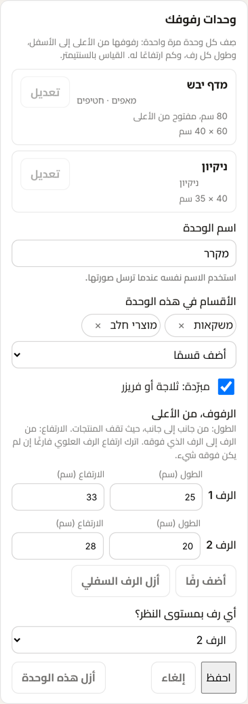 | 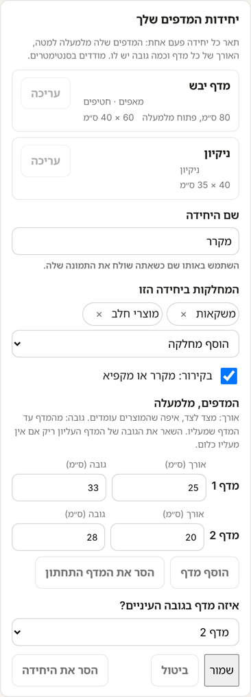 |

### Store layout, with heights

Each shelf's height beside its length. "Height not measured yet" lists the products the reader has not measured, as "Width not measured yet" does.

| العربية | עברית |
|---|---|
| 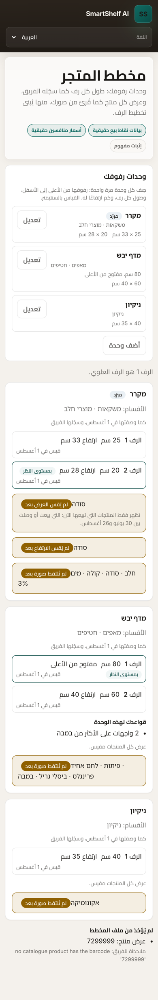 | 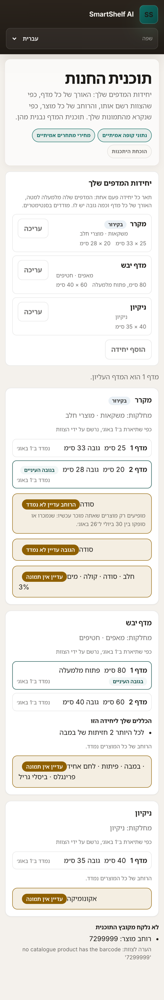 |

### Shelf plan, drawn to scale

Each shelf as tall as it is, and each product as tall as it is. The cleaning unit lists the 4-litre bleach as taller than every shelf, with its height.

| العربية | עברית |
|---|---|
| 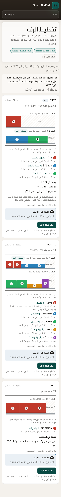 | 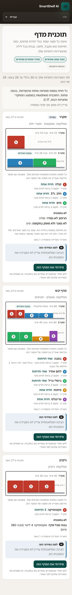 |

### The team account

Read-only, as every control is for the team (ADR-029).

| العربية | עברית |
|---|---|
| 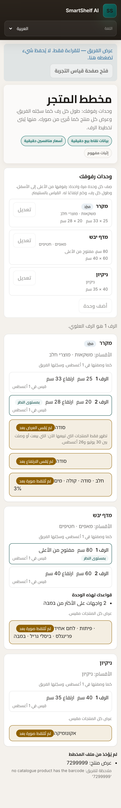 | 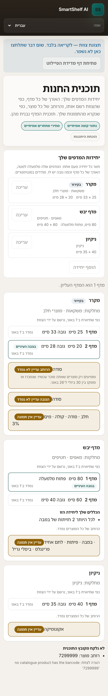 |

## The new wording

Every phrase the screens add, as the dictionaries hold it on the branch. `{date}`, `{cm}`, `{mm}`,
`{length}`, `{height}` and `{name}` are filled in by the page.

| Key | English | עברית | العربية |
|---|---|---|---|
| `units.title` | Your shelving units | יחידות המדפים שלך | وحدات رفوفك |
| `units.how` | Describe each unit once: its shelves from top to bottom, how long each shelf is, and how much height it has. Measure in centimetres. | תאר כל יחידה פעם אחת: המדפים שלה מלמעלה למטה, האורך של כל מדף וכמה גובה יש לו. מודדים בסנטימטרים. | صِف كل وحدة مرة واحدة: رفوفها من الأعلى إلى الأسفل، وطول كل رف، وكم ارتفاعًا له. القياس بالسنتيمتر. |
| `units.none` | No unit is described yet. | עדיין לא תוארה אף יחידה. | لم تُوصف أي وحدة بعد. |
| `units.add` | Add a unit | הוסף יחידה | أضف وحدة |
| `units.edit` | Edit | עריכה | تعديل |
| `units.name` | The unit's name | שם היחידה | اسم الوحدة |
| `units.name.hint` | Use the same name when you send its photo. | השתמש באותו שם כשאתה שולח את התמונה שלה. | استخدم الاسم نفسه عندما ترسل صورتها. |
| `units.departments` | Departments on this unit | המחלקות ביחידה הזו | الأقسام في هذه الوحدة |
| `units.departments.add` | Add a department | הוסף מחלקה | أضف قسمًا |
| `units.departments.remove` | Remove {name} | הסר את {name} | أزل {name} |
| `units.chilled` | Chilled: a fridge or freezer | בקירור: מקרר או מקפיא | مبرّدة: ثلاجة أو فريزر |
| `units.shelves` | Shelves, from the top | המדפים, מלמעלה | الرفوف، من الأعلى |
| `units.measure` | Length: from side to side, where products stand. Height: from the shelf up to the shelf above it. Leave the top shelf's height empty if nothing is above it. | אורך: מצד לצד, איפה שהמוצרים עומדים. גובה: מהמדף עד המדף שמעליו. השאר את הגובה של המדף העליון ריק אם אין מעליו כלום. | الطول: من جانب إلى جانب، حيث تقف المنتجات. الارتفاع: من الرف إلى الرف الذي فوقه. اترك ارتفاع الرف العلوي فارغًا إن لم يكن فوقه شيء. |
| `units.length` | Length (cm) | אורך (ס״מ) | الطول (سم) |
| `units.height` | Height (cm) | גובה (ס״מ) | الارتفاع (سم) |
| `units.height.top` | Open above | פתוח מלמעלה | مفتوح من الأعلى |
| `units.addShelf` | Add a shelf | הוסף מדף | أضف رفًا |
| `units.removeShelf` | Remove the bottom shelf | הסר את המדף התחתון | أزل الرف السفلي |
| `units.eyeLevel` | Which shelf is at eye level? | איזה מדף בגובה העיניים? | أي رف بمستوى النظر؟ |
| `units.eyeLevel.none` | Not set | לא נקבע | غير محدد |
| `units.save` | Save | שמור | احفظ |
| `units.saving` | Saving… | שומר… | جارٍ الحفظ… |
| `units.cancel` | Cancel | ביטול | إلغاء |
| `units.remove` | Remove this unit | הסר את היחידה | أزل هذه الوحدة |
| `units.removeConfirm` | Press again to remove it | לחץ שוב כדי להסיר אותה | اضغط مرة أخرى لإزالتها |
| `units.incomplete` | Fill in the name, at least one department, and each shelf's length and height. | מלא את השם, לפחות מחלקה אחת, ואת האורך והגובה של כל מדף. | املأ الاسم، وقسمًا واحدًا على الأقل، وطول كل رف وارتفاعه. |
| `units.nameTwice` | Another unit already has this name. | כבר יש יחידה בשם הזה. | توجد وحدة أخرى بهذا الاسم. |
| `units.saved` | Saved. The plan uses it from tonight. | נשמר. התוכנית משתמשת בזה מהלילה. | حُفظت. يستخدمها التخطيط ابتداءً من الليلة. |
| `units.failed` | It did not save. Check the connection and try again. | השמירה לא הצליחה. בדוק את החיבור ונסה שוב. | لم تُحفظ. تحقّق من الاتصال وحاول مرة أخرى. |
| `units.shelfSize` | {length} × {height} cm | {length} × {height} ס״מ | {length} × {height} سم |
| `units.shelfSize.open` | {length} cm, open above | {length} ס״מ, פתוח מלמעלה | {length} سم، مفتوح من الأعلى |
| `layout.height` | {cm} cm high | גובה {cm} ס״מ | ارتفاع {cm} سم |
| `layout.openAbove` | open above | פתוח מלמעלה | مفتوح من الأعلى |
| `layout.noHeight` | Height not measured yet | הגובה עדיין לא נמדד | لم يُقس الارتفاع بعد |
| `shelf.unplaced.no_height` | Height not measured: | הגובה לא נמדד: | لم يُقس الارتفاع: |
| `shelf.unplaced.too_tall` | Taller than every shelf: | גבוה מכל מדף: | أعلى من كل رف: |
| `layout.heightMm` | {mm} mm high | גובה {mm} מ״מ | ارتفاع {mm} مم |
| `layout.stated.app` | As you entered it on {date} | כפי שהזנת ב־{date} | كما أدخلتها في {date} |
| `shelf.extras.no_height` | No extra facings on this unit: a product whose height is not measured stands on it, so the spare length is not known to be free. | אין חזיתות נוספות ביחידה הזו: עומד בה מוצר שהגובה שלו לא נמדד, ולכן לא ידוע אם האורך שנשאר באמת פנוי. | لا واجهات إضافية في هذه الوحدة: يقف فيها منتج لم يُقس ارتفاعه، فلا يُعرف إن كان الطول المتبقي فارغًا فعلًا. |
| `shelf.extras.too_tall` | No extra facings on this unit: a product taller than its shelves stands on it, so the spare length is not known to be free. | אין חזיתות נוספות ביחידה הזו: עומד בה מוצר גבוה מהמדפים שלה, ולכן לא ידוע אם האורך שנשאר באמת פנוי. | لا واجهات إضافية في هذه الوحدة: يقف فيها منتج أعلى من رفوفها، فلا يُعرف إن كان الطول المتبقي فارغًا فعلًا. |
| `shelf.stopped.no_height` | the product’s height is not measured | הגובה של המוצר לא נמדד | ارتفاع المنتج لم يُقس |
| `shelf.stopped.too_tall` | the product is taller than every shelf | המוצר גבוה מכל מדף | المنتج أعلى من كل رف |
| `shelf.stopped.heights_unknown` | a product whose height is not measured stands on this unit, so no spare length is known | עומד ביחידה מוצר שהגובה שלו לא נמדד, ולכן לא ידוע כמה אורך פנוי | يقف في الوحدة منتج لم يُقس ارتفاعه، فلا يُعرف كم من الطول فارغ |

The last six are not drawn above. `layout.stated.app` replaces "recorded by the team" on a unit
you entered yourself. The five after it explain, on Shelf plan, why a unit gets no extra facings,
or why one of your rules cannot be met, when a height is the cause; they follow the width's
sentences word for word.

## What is built after approval

Built on the branch while this waits, and not merged: the engine, the reader and the nightly step
(the list below), with their tests. On the drawn test shelves the reader's heights came back
within 5 mm for 1,886 of 1,890 products, 4 unknown and none wrong, across three units, 30 seeds
and three levels of AI roughness. Widths are unchanged: 1,512 within 5 mm, 18 unknown, none
wrong.

One pull request:
- the form's saving, and the nightly step that writes the units into the layout file;
- shelf heights in the layout file and on the pages;
- the reader's heights and their acceptance run;
- the plan's height check and the drawing to scale;
- tests, the e2e run, and the visual proof that nothing else changed.

## The owner's answer

- **2026-10-08**, "can i see it ?": the screens were opened in the app itself, served on the owner's own
  machine with the test units and heights above. Recorded as no decision.
- **2026-10-08**, "approved", to "You can say 'approve all', or name what to change", asked of the
  five items above. Recorded as every item as drawn, with the clearance at 2 cm (F12-S1 OQ-1213,
  ADR-044).
