# The AI's explanation on each Reorder card — mockups for approval

D-40 (2026-10-09): every order suggestion carries the AI's explanation of why that quantity. These
are the Reorder screens that F14-S1 proposes for it, their words in the three languages, and what
you are asked to decide. Nothing here is merged or shown to a store until you approve it.

**How they were made.** They were drawn inside the real app, in the e2e build, at phone size
(390 × 844). The code is on the branch `ui/f14-mockups`, which is not merged. In these pictures:
- **the shop is Reorder's marked example** (D-29), the test shop, not any store's data;
- **every explanation is HAND-WRITTEN SAMPLE WORDING, not the model's.** The model has never been
  asked: no store sends daily sales (D-23), and the model key is not set up. Each sample was written
  around the slots only, and each passes F14-S1's mechanical check (FR-238, Appendix A): no number
  of any kind outside the slots, in digits or in words, no "tomorrow", no %, no ₪, no product name.
  The samples were given to the page only while these pictures were taken. They are not in the
  app's data, and not in the example file;
- **every figure on the cards is the engine's own** over the test shop: each slot is filled from
  that suggestion's published facts, as FR-238's table says;
- **מים is drawn without the stand-in boost.** Today's example shows "Expected sales raised 10%,
  the model's estimate", but that pick is a fixed test answer that no model gave. F14-S1 now proposes
  (OQ-1403, waiting on you) that the example show no stand-in pick, so מים's box says the model was
  not asked about it tonight, and its order is 21 instead of the boosted 23.

## What you are asked to decide

1. **The card** (FR-242). When a suggestion has an explanation, it replaces the engine's sentence
   ("You'll sell about … before your next order …") and the shelf-life line ("Only what sells in
   2 days …"), after the same **AI** tag Shelf plan uses. The quantity, the "Your stock count wasn't
   used" notice, the market box and the three buttons stay exactly as they are. A card without an
   explanation is today's card, with no tag.
2. **The note above the suggestions** (FR-243), once, in Shelf plan's AI box. It has four states:
   - every suggestion explained: what the AI does;
   - some explained: what the AI does, and how many of tonight's it explained;
   - none explained: that the AI has not explained tonight's suggestions;
   - no model key: that the AI's explanations are off.

   There is no note when there are no suggestions, or while Reorder waits for daily sales.
3. **The phrases that carry the figures** (FR-238, C-79), in the three languages (table below).
   The AI writes no number. It writes a slot such as `{left}`, and the page puts in a phrase like
   "about 3 left on Sunday 30 Aug". The Hebrew and Arabic phrases are new, proposed here.
4. **Three things the pictures show that you may want changed** (see "What the pictures show").

## The screens

### The example today, before the AI is asked

What the example will show until its explanations are written once with the key (FR-244): every
card shows the engine's sentence, and the note says the AI has not explained tonight's suggestions.

| العربية | עברית |
|---|---|
| 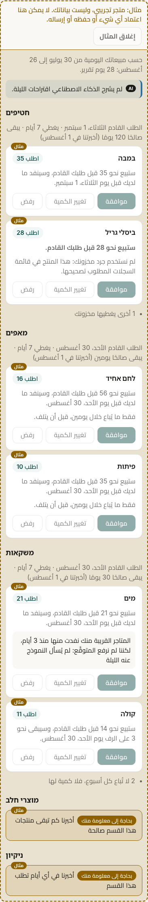 | 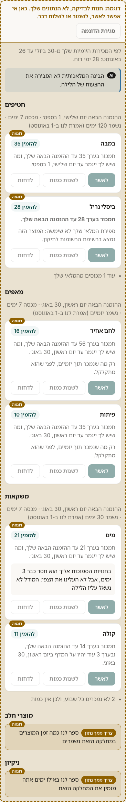 |

### Every suggestion explained

All six cards with an explanation (hand-written samples).

| العربية | עברית |
|---|---|
| 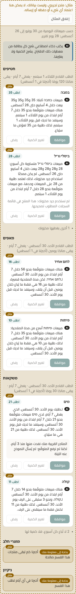 | 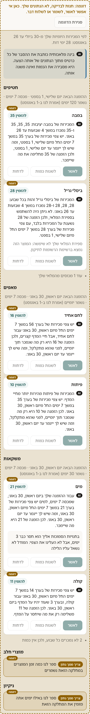 |

In English: 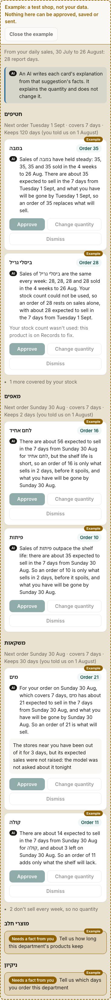

### Some explained

Four of six. ביסלי גריל's explanation was held back by the check, and מים's was not written
tonight. Both show the engine's sentence, as the note says.

| العربية | עברית |
|---|---|
| 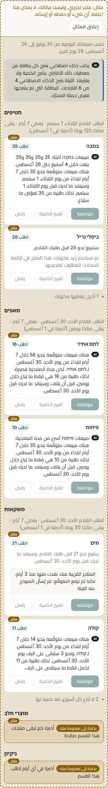 | 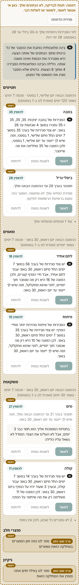 |

### No model key

| العربية | עברית |
|---|---|
| 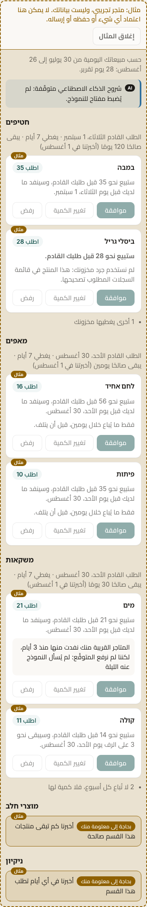 | 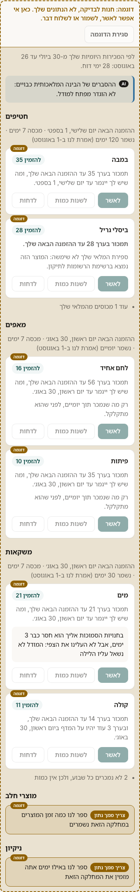 |

### Each kind of card, close up

| Card | What it shows | العربية | עברית | English |
|---|---|---|---|---|
| במבה | stock gone by the order day: `{runs_out}`; the weeks: `{weeks}` | 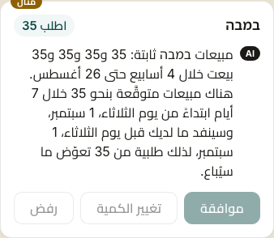 | 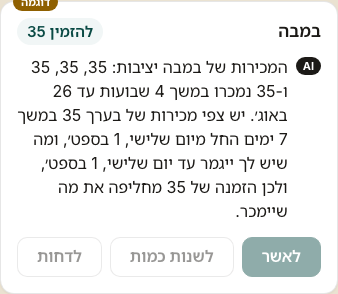 | 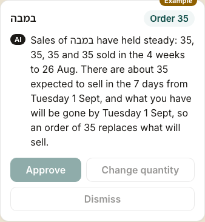 |
| ביסלי גריל | the stock count not used (gross): the notice stays under the AI's text | 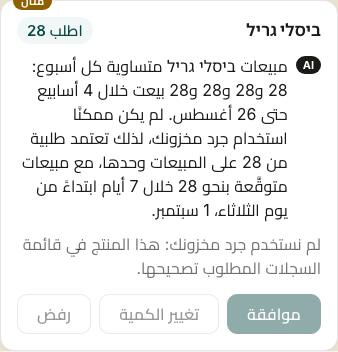 | 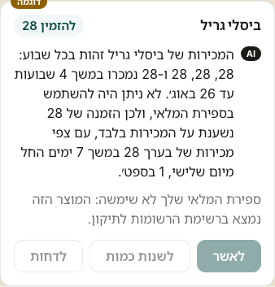 | 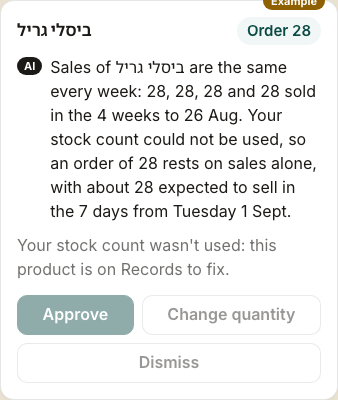 |
| לחם אחיד | capped by a 2-day shelf life: `{capped}` | 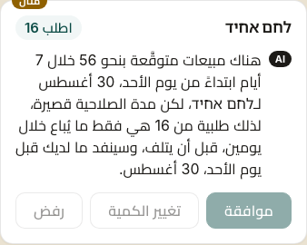 | 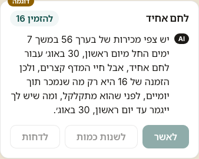 | 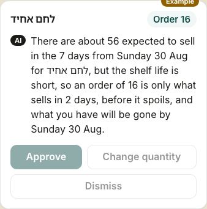 |
| פיתות | capped, a second wording |  | 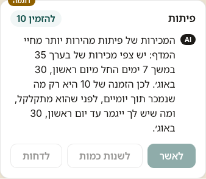 | 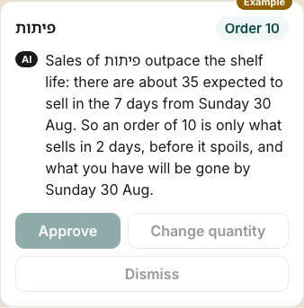 |
| מים | the order day and its days: `{next_order}`; the market box without the stand-in boost | 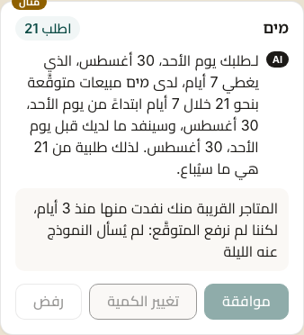 | 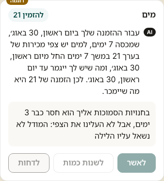 | 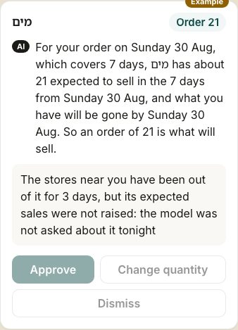 |
| קולה | stock left on the order day: `{left}` | 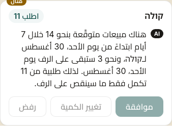 | 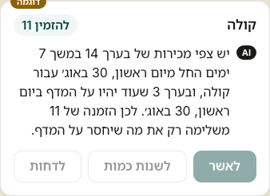 | 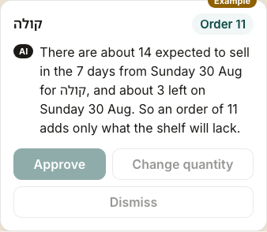 |

## What the pictures show

1. **A text that uses several slots repeats the date.** Each phrase names its own period, so that
   no figure is read against the wrong days (FR-238). On מים, `{next_order}`, `{expected}` and
   `{runs_out}` each say "Sunday 30 Aug", so the date appears three times. The prompt could steer the
   model away from `{next_order}` when `{expected}` already names the days, or the phrases could be
   shortened. That is a change to F14-S1, if you want it.
2. **Hebrew and Arabic cannot agree with the product.** The model is never sent the product's name
   (FR-236), and one text may serve another product of the same department (FR-239), so it cannot
   know whether the name is masculine, feminine or plural. The samples are written around that,
   with "the sales of {product}" (המכירות של / مبيعات) rather than "{product} sells". The prompt
   would have to ask the model for the same.
3. **The weeks' figures in Hebrew and Arabic.** `{weeks}` lists each week's units, oldest first. In
   this test shop every week sold the same, so the pictures cannot show whether a list of different
   figures reads in the right order from right to left. That is checked when the page is built.

## The words

### The tag and the note

| Key | English | עברית | العربية |
|---|---|---|---|
| tag (Shelf plan's) | AI | AI | AI |
| note: what the AI does | An AI writes each card's explanation from that suggestion's facts. It explains the quantity and does not change it. | בינה מלאכותית כותבת את ההסבר של כל כרטיס מתוך הנתונים של אותה הצעה. היא מסבירה את הכמות ואינה משנה אותה. | يكتب ذكاء اصطناعي شرح كل بطاقة من معطيات ذلك الاقتراح. يشرح الكمية ولا يغيّرها. |
| note: some explained | Tonight the AI explained {n} of {total} suggestions. A card it did not explain shows the engine's sentence. | הלילה הבינה המלאכותית הסבירה {n} מתוך {total} הצעות. כרטיס שלא הוסבר מציג את המשפט של המנוע. | الليلة شرح الذكاء الاصطناعي {n} من {total} اقتراحات. البطاقة التي لم يشرحها تعرض جملة المحرّك. |
| note: none explained | The AI has not explained tonight's suggestions. | הבינה המלאכותית לא הסבירה את ההצעות של הלילה. | لم يشرح الذكاء الاصطناعي اقتراحات الليلة. |
| note: no model key | The AI's explanations are off: no key for the model has been set up. | ההסברים של הבינה המלאכותית כבויים: לא הוגדר מפתח למודל. | شروح الذكاء الاصطناعي متوقّفة: لم يُضبط مفتاح للنموذج. |

### The phrases that carry the figures (FR-238)

The figures and dates in braces are the card's own: one decimal, the card's words for a number of
days, and its date format. `{runs_out}` and `{capped}` are the card's own sentences today.

| Slot | English | עברית | العربية |
|---|---|---|---|
| `{quantity}` | an order of {n} | הזמנה של {n} | طلبية من {n} |
| `{expected}` | about {expected} expected to sell in the {days} from {day} | צפי מכירות של בערך {expected} במשך {days} החל מ{day} | مبيعات متوقَّعة بنحو {expected} خلال {days} ابتداءً من يوم {day} |
| `{weeks}` | {list} sold in the {weeks} to {date} | {list} נמכרו במשך {weeks} עד {date} | {list} بيعت خلال {weeks} حتى {date} |
| `{next_order}` | your order on {day}, which covers {days} | ההזמנה שלך ב{day}, שמכסה {days} | طلبك يوم {day}، الذي يغطي {days} |
| `{left}` | about {left} left on {day} | בערך {left} שעוד יהיו על המדף ב{day} | نحو {left} ستبقى على الرف يوم {day} |
| `{runs_out}` | what you have will be gone by {day} | מה שיש לך ייגמר עד {day} | سينفد ما لديك قبل يوم {day} |
| `{capped}` | only what sells in {days}, before it spoils | רק מה שנמכר תוך {days}, לפני שהוא מתקלקל | فقط ما يُباع خلال {days}، قبل أن يتلف |
| `{product}` | the product's name | שם המוצר | اسم المنتج |

### The hand-written samples (NOT the model's)

Written only to draw the cards. The model's own texts will differ. Each passes FR-238's check.

| Card | English | עברית | العربية |
|---|---|---|---|
| במבה | Sales of {product} have held steady: {weeks}. There are {expected}, and {runs_out}, so {quantity} replaces what will sell. | המכירות של {product} יציבות: {weeks}. יש {expected}, ו{runs_out}, ולכן {quantity} מחליפה את מה שיימכר. | مبيعات {product} ثابتة: {weeks}. هناك {expected}، و{runs_out}، لذلك {quantity} تعوّض ما سيُباع. |
| ביסלי גריל | Sales of {product} are the same every week: {weeks}. Your stock count could not be used, so {quantity} rests on sales alone, with {expected}. | המכירות של {product} זהות בכל שבוע: {weeks}. לא ניתן היה להשתמש בספירת המלאי, ולכן {quantity} נשענת על המכירות בלבד, עם {expected}. | مبيعات {product} متساوية كل أسبوع: {weeks}. لم يكن ممكنًا استخدام جرد مخزونك، لذلك تعتمد {quantity} على المبيعات وحدها، مع {expected}. |
| לחם אחיד | There are {expected} for {product}, but the shelf life is short, so {quantity} is {capped}, and {runs_out}. | יש {expected} עבור {product}, אבל חיי המדף קצרים, ולכן {quantity} היא {capped}, ו{runs_out}. | هناك {expected} لـ{product}، لكن مدة الصلاحية قصيرة، لذلك {quantity} هي {capped}، و{runs_out}. |
| פיתות | Sales of {product} outpace the shelf life: there are {expected}. So {quantity} is {capped}, and {runs_out}. | המכירות של {product} מהירות יותר מחיי המדף: יש {expected}. לכן {quantity} היא {capped}, ו{runs_out}. | مبيعات {product} أسرع من مدة الصلاحية: هناك {expected}. لذلك {quantity} هي {capped}، و{runs_out}. |
| מים | For {next_order}, {product} has {expected}, and {runs_out}. So {quantity} is what will sell. | עבור {next_order}, ל{product} יש {expected}, ו{runs_out}. לכן {quantity} היא מה שיימכר. | لـ{next_order}، لدى {product} {expected}، و{runs_out}. لذلك {quantity} هي ما سيُباع. |
| קולה | There are {expected} for {product}, and {left}. So {quantity} adds only what the shelf will lack. | יש {expected} עבור {product}, ו{left}. לכן {quantity} משלימה רק את מה שיחסר על המדף. | هناك {expected} لـ{product}، و{left}. لذلك {quantity} تكمل فقط ما سينقص على الرف. |
