# F8 screens — mockups for approval

Front-end work waits for the repository owner (plan item 5; his rule of 2026-09-16). These are
the screens Task 5.13 and Task 5.14 will build, and nothing else: until he approves them, the
three F8 capabilities stay in `NOT_YET_SHOWN` and reach no screen.

**How they were made.** Drawn inside the real app (the e2e build), so the header, fonts,
colours, cards and buttons are the app's own, at phone size (390 × 844). Every figure on them is
the engine's: `run_engine` in print mode over Task 5.11's fixture world, extended with a flagged
count (a gross suggestion), a product covered by stock, a bakery department whose shelf life caps
its quantity, and three departments each missing a different fact. It is a test shop, not his
data.

**The review page**, with every screen in Arabic, Hebrew and English side by side:
https://claude.ai/artifact/6dNAd49p7N4qe5rRX1AnBb (private to the repository owner).

## What he is asked to decide

1. **The four screens**: Reorder (filled, on a night with no model key, and today's waiting
   state), Approved orders, the disagreement question, and the team's read-only view.
2. **All the new wording** (the first table). The Arabic and Hebrew are the engineer's
   translations and need a daily reader.
3. **The reason wording already in the dictionaries** since Tasks 5.4, 5.6 and 5.8 (the second
   table), which no screen shows yet.
4. **The language of the model's reason.** `configs/prompts/market_boost.v1.md` asks for Arabic,
   the app's default. It could be Hebrew, or all three.
5. **The Today panel's title.** "Cost questions" today; proposed "Questions only you can answer",
   now that it holds a second kind of question.

## The screens

### Reorder, with suggestions

| العربية | עברית |
|---|---|
| 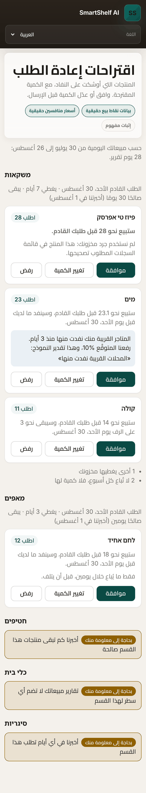 | 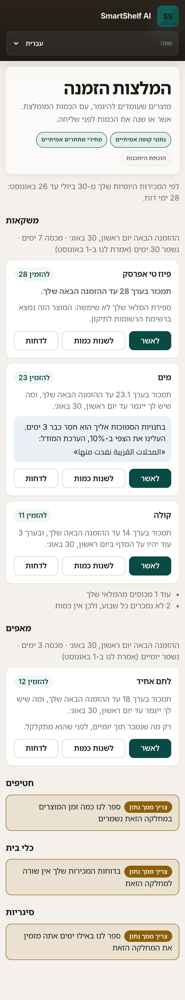 |

### Reorder, on a night with no model key

| العربية | עברית |
|---|---|
| 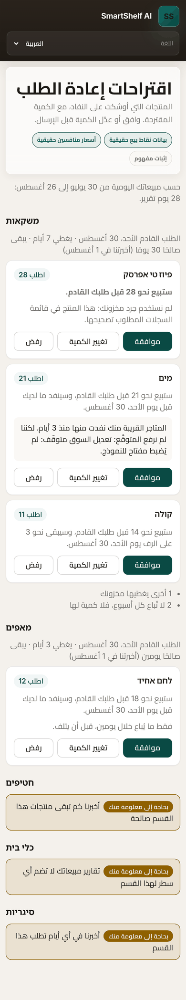 | 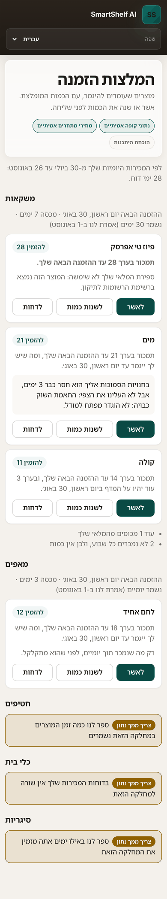 |

### Reorder, today

| العربية | עברית |
|---|---|
| 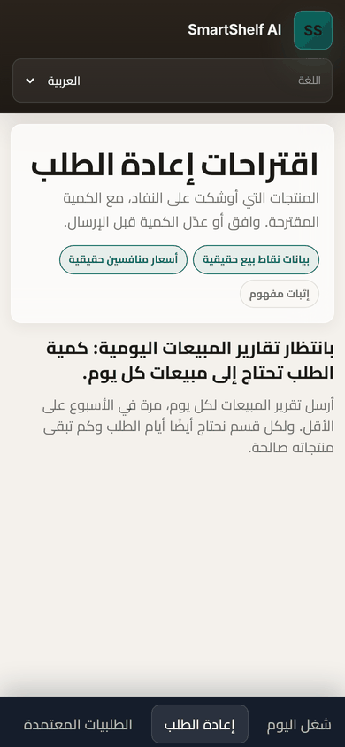 | 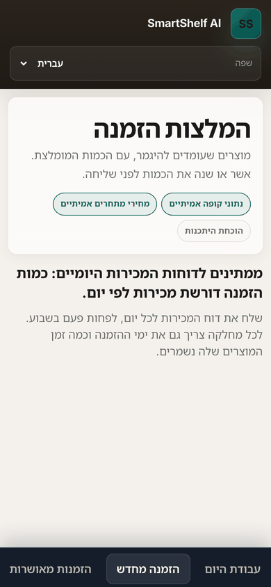 |

### Approved orders

| العربية | עברית |
|---|---|
| 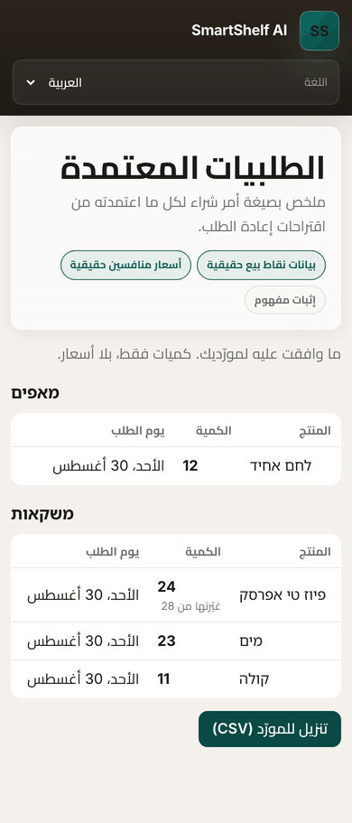 | 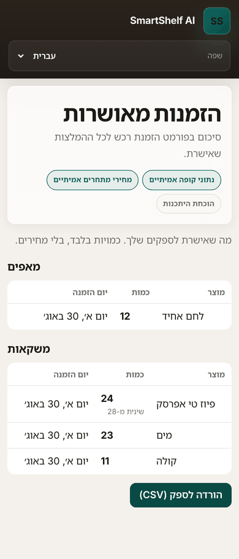 |

### The disagreement question, on Today

| العربية | עברית |
|---|---|
| 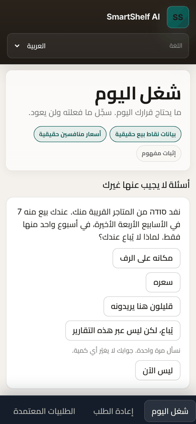 | 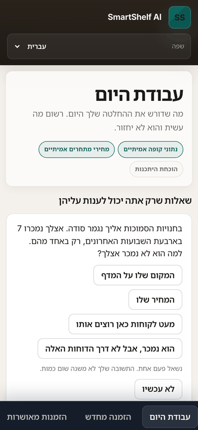 |

### Reorder, as the team sees it

| العربية | עברית |
|---|---|
| 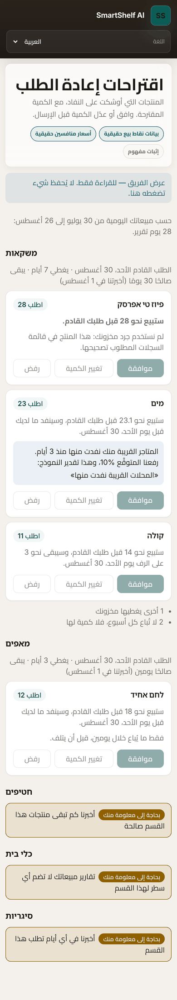 | 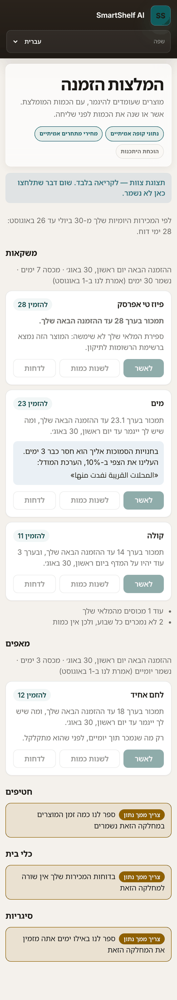 |

## All the new wording

Words in braces are filled in. Day counts use each language's own forms (يومين, יומיים), and a
percentage is set left to right inside right-to-left text.

| Key | العربية | עברית | English |
|---|---|---|---|
| `reorder.basis` | حسب مبيعاتك اليومية من {first} إلى {last}: {days} يوم تقرير. | לפי המכירות היומיות שלך מ-{first} עד {last}: {days} ימי דוח. | From your daily sales, {first} to {last}: {days} report days. |
| `reorder.nextOrder` | الطلب القادم {day} · يغطي {days} | ההזמנה הבאה {day} · מכסה {days} | Next order {day} · covers {days} |
| `reorder.keeps` | يبقى صالحًا {days} (أخبرتنا في {date}) | נשמר {days} (אמרת לנו ב-{date}) | Keeps {days} (you told us on {date}) |
| `reorder.order` | اطلب {n} | להזמין {n} | Order {n} |
| `reorder.gross` | ستبيع نحو {expected} قبل طلبك القادم. | תמכור בערך {expected} עד ההזמנה הבאה שלך. | You'll sell about {expected} before your next order. |
| `reorder.net` | ستبيع نحو {expected} قبل طلبك القادم، وسيبقى نحو {left} على الرف يوم {day}. | תמכור בערך {expected} עד ההזמנה הבאה שלך, ובערך {left} עוד יהיו על המדף ב{day}. | You'll sell about {expected} before your next order, and about {left} will still be on the shelf on {day}. |
| `reorder.netRunsOut` | ستبيع نحو {expected} قبل طلبك القادم، وسينفد ما لديك قبل يوم {day}. | תמכור בערך {expected} עד ההזמנה הבאה שלך, ומה שיש לך ייגמר עד {day}. | You'll sell about {expected} before your next order, and what you have will be gone by {day}. |
| `reorder.countNotUsed` | لم نستخدم جرد مخزونك: {why}. | ספירת המלאי שלך לא שימשה: {why}. | Your stock count wasn't used: {why}. |
| `reorder.count.count_too_old` | فهو من {date}، قبل أكثر من أسبوع | היא מ-{date}, לפני יותר משבוע | it is from {date}, more than a week ago |
| `reorder.count.count_flagged` | هذا المنتج في قائمة السجلات المطلوب تصحيحها | המוצר הזה נמצא ברשימת הרשומות לתיקון | this product is on Records to fix |
| `reorder.count.day_without_report` | يومٌ منذ الجرد بلا تقرير مبيعات | ליום אחד מאז הספירה אין דוח מכירות | a day since the count has no sales report |
| `reorder.count.deliveries_not_reported` | تقريرٌ منذ الجرد بلا بضاعة واردة | בדוח אחד מאז הספירה אין כניסות מלאי | a report since the count has no deliveries in it |
| `reorder.count.no_row_since_count` | لم يُبع في يومٍ منذ الجرد، فالوارد في ذلك اليوم غير معروف | הוא לא נמכר ביום אחד מאז הספירה, ולכן הכניסות של אותו יום לא ידועות | it didn't sell on a day since the count, so that day's deliveries are unknown |
| `reorder.count.stock_inconsistent` | الجرد والمبيعات منذه لا يتطابقان | הספירה והמכירות מאז לא מסתדרות | the count and the sales since it don't add up |
| `reorder.count.no_count` | لا يوجد له جرد | אין לו ספירה | there is no count for it |
| `reorder.count.no_count_date` | لا نعرف متى جُرد | לא ידוע מתי נספר | we don't know when it was counted |
| `reorder.boost` | المتاجر القريبة منك نفدت منها منذ {days}. رفعنا المتوقَّع {pct}، وهذا تقدير النموذج: | בחנויות הסמוכות אליך הוא חסר כבר {days}. העלינו את הצפי ב-{pct}, הערכת המודל: | The stores near you have been out of it for {days}. Expected sales raised {pct}, the model's estimate: |
| `reorder.boostNotApplied` | المتاجر القريبة منك نفدت منها منذ {days}، لكننا لم نرفع المتوقَّع: {why} | בחנויות הסמוכות אליך הוא חסר כבר {days}, אבל לא העלינו את הצפי: {why} | The stores near you have been out of it for {days}, but its expected sales were not raised: {why} |
| `reorder.boostNot.above_limit` | اختار النموذج {pct}، فوق حد {max} | המודל בחר {pct}, מעל הגבול של {max} | the model picked {pct}, above the {max} limit |
| `reorder.boostNot.below_zero` | اختار النموذج {pct}، أقل من الصفر | המודל בחר {pct}, מתחת לאפס | the model picked {pct}, below zero |
| `reorder.boostNot.unreadable` | تعذّرت قراءة جواب النموذج | לא ניתן היה לקרוא את תשובת המודל | the model's answer could not be read |
| `reorder.boostNot.facts_changed` | تغيّرت معطياته منذ سُئل النموذج | הנתונים שלו השתנו מאז שהמודל נשאל | its facts changed since the model was asked |
| `reorder.boostNot.no_pick` | لم يُسأل النموذج عنه الليلة | המודל לא נשאל עליו הלילה | the model was not asked about it tonight |
| `reorder.boostNot.ceiling_reached` | بلغنا حد أسئلة النموذج لهذه الليلة | הגענו למכסת השאלות למודל הלילה | tonight's limit of questions to the model was reached |
| `reorder.boostWithheld` | (حُجب تعليله لأنه ذكر رقمًا) | (הנימוק שלו הוסתר כי נקב במספר) | (its reason was withheld because it stated a figure) |
| `reorder.capped` | فقط ما يُباع خلال {days}، قبل أن يتلف. | רק מה שנמכר תוך {days}, לפני שהוא מתקלקל. | Only what sells in {days}, before it spoils. |
| `reorder.approve` | موافقة | לאשר | Approve |
| `reorder.change` | تغيير الكمية | לשנות כמות | Change quantity |
| `reorder.dismiss` | رفض | לדחות | Dismiss |
| `reorder.covered` | {n} أخرى يغطيها مخزونك | עוד {n} מכוסים מהמלאי שלך | {n} more covered by your stock |
| `reorder.reason.not_moving` | {n} لا تُباع كل أسبوع، فلا كمية لها | {n} לא נמכרים כל שבוע, ולכן אין כמות | {n} don't sell every week, so no quantity |
| `reorder.reason.below_one_per_cycle` | {n} تُباع أقل من واحدة في كل طلب | {n} נמכרים פחות מאחד בכל הזמנה | {n} sell less than one per order |
| `reorder.reason.cap_rounds_to_zero` | {n} تُباع بكمية قليلة جدًا قبل أن تتلف | {n} נמכרים מעט מדי לפני שהם מתקלקלים | {n} sell too little before they spoil |
| `reorder.reason.shelf_life_under_a_day` | تبقى صالحة أقل من يوم، فلا كمية | נשמרים פחות מיום, ולכן אין כמות | Keeps less than a day, so no quantity |
| `reorder.reason.no_order_schedule` | أخبرنا في أي أيام تطلب هذا القسم | ספר לנו באילו ימים אתה מזמין את המחלקה הזאת | Tell us which days you order this department |
| `reorder.reason.no_fixed_days` | تطلب هذا عند الحاجة، فلا كمية | אתה מזמין את זה לפי הצורך, ולכן אין כמות | You order this when needed, so no quantity |
| `reorder.reason.no_shelf_life` | أخبرنا كم تبقى منتجات هذا القسم صالحة | ספר לנו כמה זמן המוצרים במחלקה הזאת נשמרים | Tell us how long this department's products keep |
| `reorder.reason.no_window` | لا تكفي التقارير اليومية بعد: نحتاج {min} من آخر {window} يومًا، وواحدًا في كل أسبوع | עדיין אין מספיק דוחות יומיים: צריך {min} מתוך {window} הימים האחרונים, ואחד בכל שבוע | Not enough daily reports yet: we need {min} of the last {window} days, and one in each week |
| `reorder.reason.not_itemised` | تقارير مبيعاتك لا تضم أي سطر لهذا القسم | בדוחות המכירות שלך אין שורה למחלקה הזאת | Your sales reports have no row for this department |
| `reorder.needsFacts` | بحاجة إلى معلومة منك | צריך ממך נתון | Needs a fact from you |
| `reorder.waiting.next` | أرسل تقرير المبيعات لكل يوم، مرة في الأسبوع على الأقل. ولكل قسم نحتاج أيضًا أيام الطلب وكم تبقى منتجاته صالحة. | שלח את דוח המכירות לכל יום, לפחות פעם בשבוע. לכל מחלקה צריך גם את ימי ההזמנה וכמה זמן המוצרים שלה נשמרים. | Send the sales report for each day, at least once a week. Each department also needs the days you order it and how long its products keep. |
| `orders.lead` | ما وافقت عليه لمورّديك. كميات فقط، بلا أسعار. | מה שאישרת לספקים שלך. כמויות בלבד, בלי מחירים. | What you approved for your suppliers. Quantities only, no prices. |
| `orders.product` | المنتج | מוצר | Product |
| `orders.quantity` | الكمية | כמות | Quantity |
| `orders.day` | يوم الطلب | יום הזמנה | Order day |
| `orders.changed` | غيّرتها من {n} | שינית מ-{n} | you changed it from {n} |
| `orders.csv` | تنزيل للمورّد (CSV) | הורדה לספק (CSV) | Download for your supplier (CSV) |
| `questions.title` | أسئلة لا يجيب عنها غيرك | שאלות שרק אתה יכול לענות עליהן | Questions only you can answer |
| `questions.disagreement` | نفد {product} من المتاجر القريبة منك. عندك بيع منه {units} في الأسابيع الأربعة الأخيرة، في {weeks} منها فقط. لماذا لا يُباع عندك؟ | בחנויות הסמוכות אליך נגמר {product}. אצלך נמכרו {units} בארבעת השבועות האחרונים, רק ב{weeks} מהם. למה הוא לא נמכר אצלך? | The stores near you have run out of {product}. Here you sold {units} in the last four weeks, in only {weeks} of them. Why doesn't it sell here? |
| `questions.disagreementNoSales` | نفد {product} من المتاجر القريبة منك. وصلتك منه بضاعة، لكن تقارير الأسابيع الأربعة الأخيرة لا تُظهر أي بيع له. لماذا لا يُباع عندك؟ | בחנויות הסמוכות אליך נגמר {product}. אצלך הוא התקבל במלאי, אבל בדוחות של ארבעת השבועות האחרונים אין לו מכירה. למה הוא לא נמכר אצלך? | The stores near you have run out of {product}. It was delivered here, but the last four weeks of reports show no sale of it. Why doesn't it sell here? |
| `questions.disagreementNoRow` | نفد {product} من المتاجر القريبة منك. تقارير مبيعاتك لا تضم سطرًا له. لماذا؟ | בחנויות הסמוכות אליך נגמר {product}. בדוחות המכירות שלך אין לו שורה. למה? | The stores near you have run out of {product}. Your sales reports have no row for it. Why? |
| `questions.answer.shelf_place` | مكانه على الرف | המקום שלו על המדף | Its place on the shelf |
| `questions.answer.price` | سعره | המחיר שלו | Its price |
| `questions.answer.weak_market` | قليلون هنا يريدونه | מעט לקוחות כאן רוצים אותו | Few customers here want it |
| `questions.answer.sells_elsewhere` | يُباع، لكن ليس عبر هذه التقارير | הוא נמכר, אבל לא דרך הדוחות האלה | It sells, but not through these reports |
| `questions.onceOnly` | نسأل مرة واحدة. جوابك لا يغيّر أي كمية. | נשאל פעם אחת. התשובה שלך לא משנה שום כמות. | Asked once. Your answer changes no quantity. |
| `questions.later` | ليس الآن | לא עכשיו | Not now |

## Reason wording already in the app (Tasks 5.4, 5.6, 5.8)

| Key | العربية | עברית | English |
|---|---|---|---|
| `unavailable.market_signal_thin` | لا تتوفّر أيام حديثة كافية من قوائم المتاجر القريبة لمعرفة ما ينفد لديها. | אין מספיק ימים אחרונים מרשימות החנויות הסמוכות כדי לדעת מה חסר אצלן. | We have too few recent days of the nearby stores' listings to tell what they are running out of. |
| `unavailable.market_signal_stale` | قوائم المتاجر القريبة ليست محدّثة، فلا نستطيع أن نقول ما ينفد لديها اليوم. | הרשימות של החנויות הסמוכות אינן עדכניות, ולכן איננו יכולים לומר מה חסר אצלן היום. | The nearby stores' listings are out of date, so we cannot say what they are running out of today. |
| `unavailable.no_boost_key` | تعديل السوق متوقّف: لم يُضبط مفتاح للنموذج. | התאמת השוק כבויה: לא הוגדר מפתח למודל. | The market adjustment is off: no key for the model has been set up. |
| `unavailable.boost_unavailable` | لم نتمكّن من الوصول إلى النموذج الليلة، فلم يُطبَّق تعديل السوق. | לא הצלחנו להגיע למודל הלילה, ולכן לא הוחלה התאמת שוק. | We could not reach the model tonight, so no market adjustment was applied. |
| `unavailable.no_daily_sales` | بانتظار تقارير المبيعات اليومية: كمية الطلب تحتاج إلى مبيعات كل يوم. | ממתינים לדוחות המכירות היומיים: כמות הזמנה דורשת מכירות לפי יום. | We are waiting for the daily sales reports: an order quantity needs sales per day. |
| `unavailable.stale_daily_sales` | آخر تقرير مبيعات يومي أقدم من أن يُبنى عليه طلب الليلة. | דוח המכירות היומי האחרון ישן מדי כדי לקבוע את ההזמנות של הלילה. | The latest daily sales report is too old to size tonight's orders. |
| `unavailable.no_store_facts` | ملف معطيات المتجر مفقود، فلا يُعرف جدول الطلبات ولا مدة الصلاحية. | קובץ נתוני החנות חסר, ולכן לא ידועים לוח ההזמנות וחיי המדף. | The store facts file is missing, so no order schedule or shelf life is known. |

## His answer

Not yet given. Task 5.13 does not start until it is, and it is recorded here with its date.
