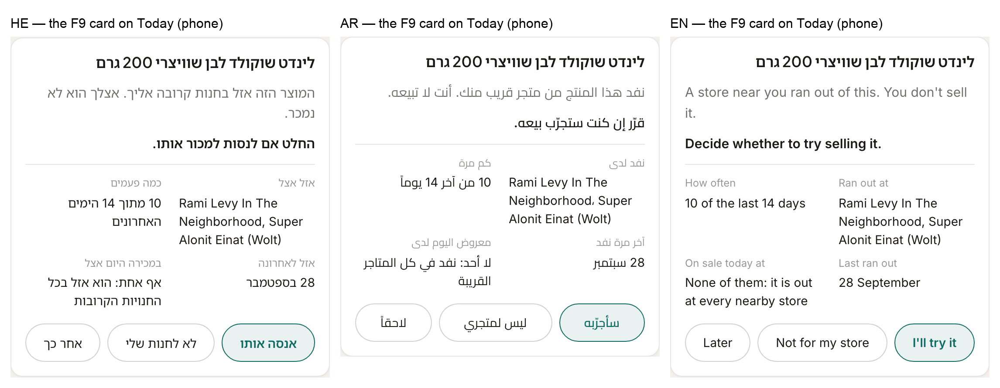
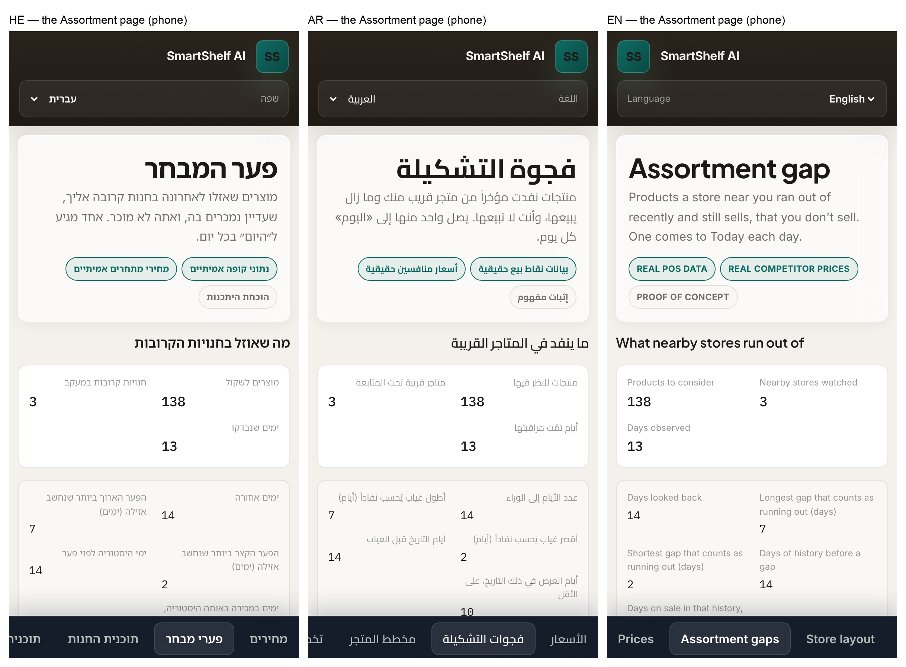

# F9's card and page

> **Approved by the repository owner on 2026-09-29** ("approve"), as shown below.

F9 publishes on real data from the nightly of 2026-09-29, and reaches no screen until these
are approved (FR-175). Both were rendered from this branch's build, with the committed
artefact plus a real `assortment_gap` from the engine. They were shot at phone width in
Hebrew, Arabic and English.

## The card on Today

- **Heading:** the product's name as the market lists it. He has no name of his own for a
  product he does not stock.
- **What it is:** a store near you ran out of this, and you don't sell it.
- **What to do:** decide whether to try selling it.
- **What was seen:**
  - which stores ran out of it, by the name the store config gives them;
  - on how many of the last 14 days;
  - the last day it ran out;
  - which stores sell it today, or that none do.
- **Answers:** "I'll try it", "Not for my store", and "Later". "Not for my store" is
  recorded as a decline with no reason (FR-173).
- **No ₪ figure, and no other number** (D-25). The card's sentences are set in the text face.
  The figures face spaces Hebrew and Arabic letters apart.

On Today it takes one place, the first of the three for findings without ₪ (FR-171). On
2026-09-28 the order would have been seven price cards, this card, then two reconciliation
cards.

## The Assortment page

The nav item "Assortment gaps" has always been there. It showed "waiting for a decision"
until D-25, and now lists all of F9's findings (F6-S1 FR-102):
- its counts (products to consider, stores watched, days observed);
- the rules that produced them;
- every product below, strongest evidence first.

The "waiting for a decision" text is removed, because nothing uses it any more.

## What approval changes

`assortment_gap` leaves `NOT_YET_SHOWN`: the card appears on Today, and the page and a line on
the Data page appear. Nothing else on any screen changes.
